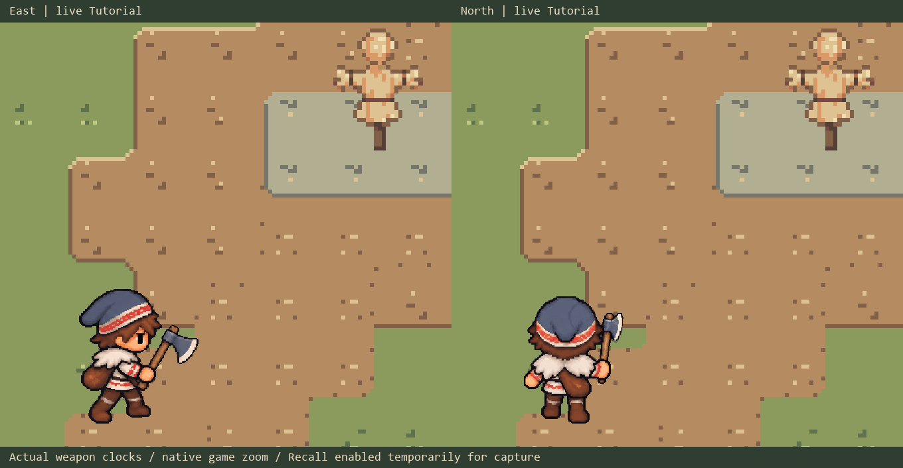

# Player animation

[Systems overview](SystemsOverview.md) · [World and tilemaps](World.md)

The player uses authored whole-body sprite poses with synchronized body and hatchet layers. Planted feet, torso rotation and arm movement give actions weight, while unequal frame durations keep anticipation, impact and recovery readable.

The original [character sheet](../RoadOfTheOldKing/Assets/Art/Sprites/Player/PlayerSheet.png) establishes the compact proportions, muted colors, patterned cap trim, simple hands and hatchet scale.

## Gameplay preview

[South action loop](Art/Player/Previews/Live-Action-Loop-South.gif) · [West action loop](Art/Player/Previews/Live-Action-Loop-West.gif) · [Character comparison](Art/Player/Previews/Current-Continuity.png) · [Hatchet handoffs](Art/Player/Previews/Axe-Continuity.png)

These captures show the animation and weapon systems in Tutorial with Recall enabled; the older captures retain the previous perspective-based flight art. They do not represent a completed Tutorial progression sequence.

## Layers and weapon ownership

The body and axe originate in the same drawing, then become complementary layers sharing a canvas and foot pivot. This preserves the drawn grip and perspective without rotating a separate held axe against a stationary hand.

- **Body:** the whole-character pose, including the hand that occludes the weapon.
- **Weapon:** the matching held-axe layer. At release, physical weapon ownership determines the transition to the independent flying axe.
- **Unarmed body:** a dedicated replacement pose where needed, synchronized to the same action phase. East, west and south sprint have separate empty-hand tracks.
- **Reveal patches:** hidden-body artwork used only for editor inspection. These remain outside Unity's imported assets and are loaded on demand; gameplay does not depend on them.

Registered frames use a 640 x 640 canvas, 128 pixels per unit and a common foot pivot at (320, 96) from the bottom. Point filtering and uncompressed textures preserve the artwork. The canvas fixes registration between layers; it is not the character's on-screen height.

## Playback and timing

[RegisteredPlayerAnimation](../RoadOfTheOldKing/Assets/Scripts/Player/RegisteredPlayerAnimation.cs) selects matching frames from [RegisteredActionSprites](../RoadOfTheOldKing/Assets/Scripts/Player/RegisteredActionSprites.cs). Gameplay owns the clock, possession and hit windows; presentation samples that state without applying damage or spending stamina.

| Action | Frames per cardinal view | Playback |
| --- | ---: | --- |
| Opening forehand | 6 | Authored exposures map to gameplay anticipation, contact and recovery |
| Stationary aim / throw | 8 | Preparation, held aim and release follow the throw clock |
| Catch | 4 | Reach holds until confirmed arrival, followed by grip and recovery |
| Dash | 5 | Travel and recovery follow the gameplay dash |
| Sprint | 8 | Actual distance traveled drives gait phase |
| Detached hatchet | One shared sprite | Seven rotations per second; fixed direction-based landing |

The registered body tracks contain 148 frame slots, including reuse and 24 separate unarmed sprint frames. The original 16-frame locomotion sheet remains separate. Idle/walk use Unity animation clips; gameplay-driven action sequences use custom assets under `Assets/Animations`.

Tap **E** quick-throws; holding **E** enters aim and releasing throws. Quick throws release at 120 ms, or 40 ms after releasing a prepared hold. The frame transition shares the physical launch marker, including when a simulation step crosses that marker. Catch presentation follows confirmed arrival so the player cannot appear to own the axe early.

The detached axe reuses the pickup sprite at 1.15x scale, centered on its collision position during flight and after landing. A short trail supplies motion feedback; the held drawings and pickup pivot remain separate from this presentation.

Sprint advances one cycle per 3.2 units traveled; pushing against a wall stops the gait. Melee contact and hit pause follow gameplay timing, and dash frames do not extend the dodge immunity window.

## Movement and directional coverage

| Family | Previews |
| --- | --- |
| Walk / idle | [Locomotion](Art/Player/Previews/Locomotion.gif), [idle breathing](Art/Player/Previews/Idle.gif) |
| Sprint | [East/west mirror](Art/Player/Previews/Sprint-East-West.gif), [east/north](Art/Player/Previews/Sprint-Directions.gif), [south](Art/Player/Previews/Sprint-South.gif) |
| Dash | [East/north](Art/Player/Previews/Dash-Directions.gif), [south](Art/Player/Previews/Dash-South.gif), [west](Art/Player/Previews/Dash-West.gif) |
| Opening strike | [South overhead](Art/Player/Previews/Forehand-South.gif), [west](Art/Player/Previews/Forehand-West.gif) |
| Throw | [South](Art/Player/Previews/Throw-South.gif), [west](Art/Player/Previews/Throw-West.gif) |

Movement and aiming are continuous, while dedicated action artwork uses four cardinal views. Existing locomotion and combat poses cover moving aim/catch and later combo/cleave actions; dedicated replacements for those actions are not yet complete.
