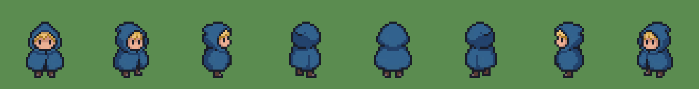
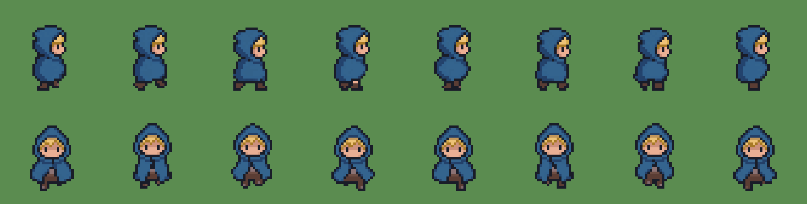
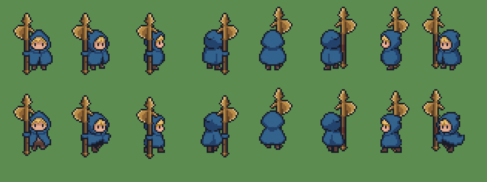

# Player animation

[Systems overview](SystemsOverview.md) · [World and tilemaps](World.md)

The hero is a small, arm-less wanderer wrapped in a blue hooded cloak, drawn as 16-bit-style pixel art in eight directions. Sprites are generated with [PixelLab](https://www.pixellab.ai/): standing views on a 32 x 32 canvas and animations on a padded 40 x 40 canvas at the same figure scale, imported at 16 pixels per unit, the density of the world tiles, so character and terrain pixels match.

Currently implemented: the standing views, an eight-frame walk and run, and a four-frame dash in all directions. Light attacks, the finisher, the charged cleave, throw, catch, hurt, death, resting and pickup animations are still to come; until then those states fall back as described below.

## Presentation

`PlayerSpriteAnimator` is the only component that writes the body sprite. It reads gameplay state every frame and never drives it: movement, damage, stamina, weapon possession and action timing stay with their gameplay owners. Each gameplay state has a slot in a `PlayerAnimationSet`; each slot holds a `DirectionalSpriteAnimation` with up to eight directional frame sequences.

| Slot | Played while | Clock |
| --- | --- | --- |
| Rotations | Any state without its own animation | Single standing view per direction |
| Idle | Standing | Time, looping |
| Walk / Run | Moving / sprinting | Distance travelled (3 / 4.5 units per cycle), so feet never slide |
| Dash | Dodge dash | Dash progress |
| Light attack 1, 2, finisher | Three-hit combo | Weapon action progress, contact frame aligned with the damage window |
| Charge / Cleave | Charged spin attack | Time while charging, action progress while cleaving |
| Throw aim / Throw | Holding and releasing a throw | Time while aiming; release aligned with the physical launch |
| Catching | Recall catch | Time, after confirmed arrival |
| Hurt / Death | Stagger / defeat | Time, holding the last frame |

Empty slots fall back rather than blocking: run uses walk, dash uses run or walk, actions and reactions use locomotion facing their action direction, and everything ends at the standing rotations. Slots for a combat stance, Recall gesture, getting up, pickup and resting exist but are not presented until those interactions ship.

Facing uses eight 45-degree sectors. Movement sets it while walking; attacks and throws face their committed direction. When two diagonal keys are released a moment apart (0.1 seconds by default), the hero keeps the diagonal instead of snapping to whichever key was released last.

Each animation can mark a contact frame. Attack frames before it fill the wind-up and the rest fill the strike and recovery, so the drawn hit coincides with the first damaging physics step for any frame count. The throw uses the same rule with the launch moment.

## Assets and import

Each slot has a folder under `Assets/Art/Sprites/Player/<Slot>/`, containing either `<direction>.png` single frames or `<direction>/` folders of numbered frames, the layout PixelLab exports. Original exports are kept as delivered under `ArtSource/Player`. **Road of the Old King > Art > Import Player Animations** then:

- imports every frame as a single point-filtered, uncompressed sprite at 16 pixels per unit;
- measures the lowest opaque row across each direction's frames and pins the pivot there, so feet stay on the ground line while bobbing or jumping frames keep their motion;
- creates or updates the slot's animation under `Assets/Animations/Player` and assigns it in `PlayerAnimationSet.asset`.

Playback rate, looping and contact frames are edited on the animation asset and survive re-imports.

## Weapon and hit pause

The hero has no arms, so the weapon, an aged bronze halberd drawn at the same 16 pixels per unit, is always a separate sprite and never part of the body frames. Out of combat, `PlayerWeaponCarry` stands it upright at his right side, butt down, with one hold per facing: a whole-pixel grip offset, mirroring, and whether it draws in front of or behind him. On the camera side it stands a few pixels lower as a depth cue, and a small fold of his cloak (a 5 x 4 pixel sprite in his own palette, mirrored per side) wraps the grip, so a hand hidden inside the cloak appears to hold the haft. In the east view the haft runs in line with his back half; facing west it stands behind him in line with his body, and facing north behind his right side with a strip of handle showing, so he masks most of the haft and the head shows over his shoulder, as if held in front of him. Blades always point away from his face. The importer measures every frame's figure height, so the weapon and fold rise and fall with the walk's bob.

During attacks and throws the weapon is still placed procedurally along the aim; a combat presentation that brings it to the ready, following the cursor, is planned. The weapon starts planted upright in the Tutorial's chopping stump. Detached flight, landing and Recall are unchanged.

A confirmed light hit pauses only the swing's action clock. The pause belongs to `AxeWeapon` and is tuned on `AxeSettings` (`lightHitPause`, `finisherHitPauseMultiplier`); animation frames freeze with it because they sample that clock.

## Previous character art

Until 28 September 2026 the player used a hand-assembled four-direction set at 128 pixels per unit, with separately registered body and axe layers. It was retired in favor of the native-density PixelLab hero. A few samples remain for reference: the [original character sheet](Art/Player/Legacy/PlayerSheet.png), [reference board](Art/Player/Legacy/Original-Reference.png), [walk cycle](Art/Player/Legacy/Locomotion.gif) and [combat loop](Art/Player/Legacy/Live-Action-Loop.gif). The complete sources, exporters and captures remain in the repository history.
