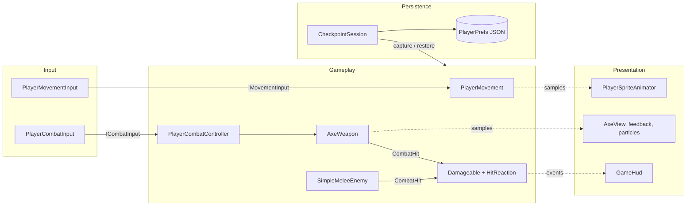
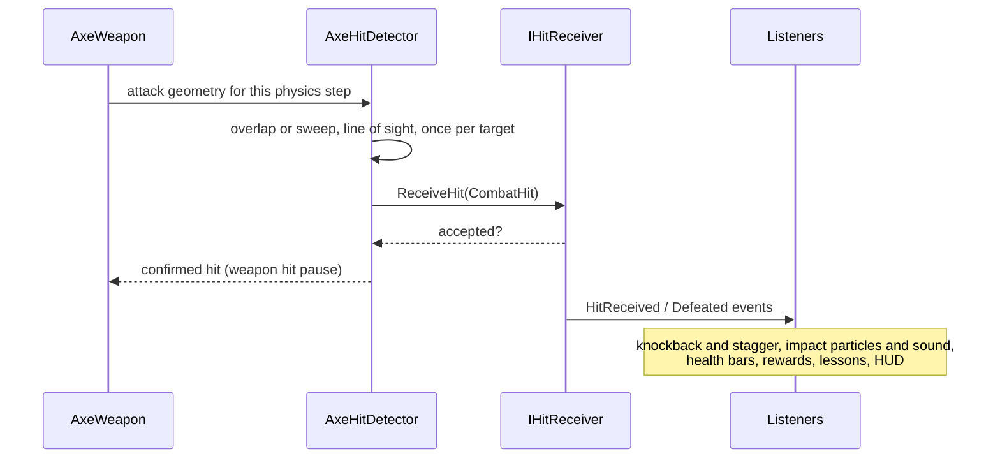
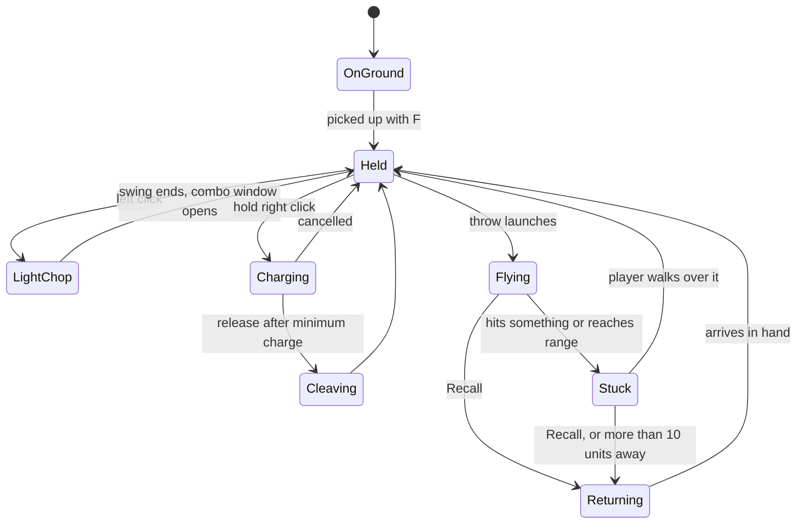
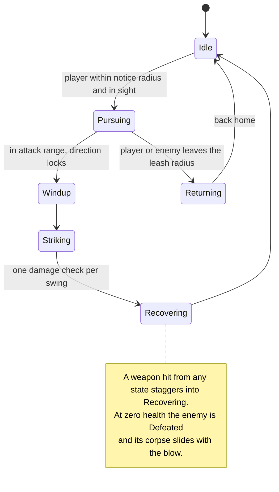
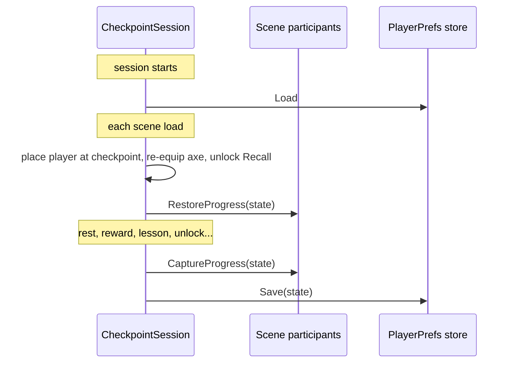
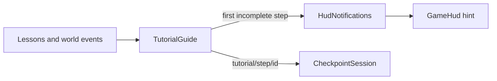

# Systems overview

[Player animation](PlayerAnimation.md) · [World and tilemaps](World.md) · [Changelog](../CHANGELOG.md)

This guide explains how Road of the Old King works at runtime: its major systems, which component owns what, and how they communicate. It describes the production game in `Tutorial.unity`, the only scene in the build. `PrototypeLoop.unity` is a retired mechanics sandbox kept for reference, and `MovementPlayground.unity` is a small movement test scene.

**Status:** the Tutorial is playable end to end: movement, axe pickup, throwing, melee, the Recall awakening, a Recall drill, the first enemy, a Sun Shard and a bonfire. The route ends at the exit trail; the first overworld region (Green Lowlands) and the transition into it are in development. HUD and menu visuals are placeholders.

[Architecture](#architecture) · [Player](#player) · [Combat](#combat) · [Enemies](#enemies) · [Progression and saving](#progression-and-saving) · [World and interaction](#world-and-interaction) · [Tutorial](#tutorial) · [Camera](#camera) · [Presentation and UI](#presentation-and-ui) · [Tools](#tools-and-verification) · [Limitations](#current-limitations) · [Key files](#key-files)

## Architecture

One rule runs through the codebase: **gameplay owns state; presentation only samples it.** Each mechanic has a single owner component, and everything else reaches it through small interfaces and C# events.

- **Single writers.** `PlayerMovement` is the only component that sets the player's velocity, `CameraFollow2D` the only one that moves the camera, and `PlayerSpriteAnimator` the only one that sets the body sprite. Dash, knockback, attack lunges and freelook feed these writers instead of competing for the component.
- **Input behind interfaces.** Movement, combat and camera look read `IMovementInput`, `ICombatInput` and `ICameraLookInput`. Bindings live in small adapter components.
- **Hits are data.** Attacks deliver a `CombatHit` value to any `IHitReceiver`. A weapon never knows what kind of object it struck.
- **Events for reactions.** `Damageable` raises `HitReceived` and `Defeated`. Knockback, particles, health bars, rewards, lessons and the HUD subscribe without the health component knowing about them.
- **Progress through participants.** Anything persistent implements `IProgressParticipant`, and anything that resets at a bonfire implements `IResetOnRest`.
- **Tuning in data.** Weapon stats, upgrades and animations are ScriptableObject assets. Scenes hold placement and per-instance overrides only.

| `Assets/Scripts/` | Responsibility |
| --- | --- |
| `Input` | Keyboard and mouse adapters behind interfaces |
| `Player` | Motor, stamina, dash, health, combat controller, interaction, animation |
| `Weapons` | Axe state machine, hit detection, throw clock, settings, upgrades, weapon visuals |
| `Combat` | Hit data, health, reactions, protection, enemy AI and presentation, encounter signal |
| `Camera` | Follow, zoom, freelook |
| `Progression` | Checkpoint session, save format and store, upgrades, heart fragments |
| `World` | Pickups, bonfires, rewards, puzzle pieces |
| `Tutorial` | Lessons, Recall awakening, guide, exit |
| `UI` | HUD, notification channel, pause menu, time control, F3 dev panel |
| `Prototype` | Legacy IMGUI HUD and PrototypeLoop scaffolding; its bonfire and defeat screens still serve the Tutorial |

Namespaces still use the project's former name (`TheLostShrine.*`) for compatibility.

## Player

`Player.prefab` is one self-contained prefab shared by every scene. The axe is a separate prefab placed in the world; the player equips it on pickup.

| Role | Components |
| --- | --- |
| Input | `PlayerMovementInput`, `PlayerCombatInput` |
| Motor | `PlayerMovement`, `PlayerDash`, `PlayerStamina` |
| Combat and health | `PlayerCombatController`, `PlayerHealth`, `Damageable`, `HitReaction` |
| Interaction | `PlayerBonfireInteraction` (pickups and bonfires) |
| Presentation | `PlayerSpriteAnimator`, `PlayerWeaponCarry`, `PlayerAimIndicator`, `PlayerMovementDust` |
| UI | `GameHud`, pause menu (`PauseMenuInput`, `PauseMenuController`, `PauseMenuView`) |

### Controls

Keyboard and mouse only.

| Input | Action |
| --- | --- |
| WASD / arrow keys | Move |
| Shift (hold) | Sprint |
| Space | Dash / dodge |
| Left click | Light combo: sweep, reverse sweep, thrust |
| Right click (hold, release) | Charged cleave |
| E | Tap to throw, hold to aim and release to throw; while the axe is away, Recall |
| F | Pick up, rest at a bonfire |
| Tab | Status panel |
| Left Alt (hold) | Look toward the cursor |
| Mouse wheel | Zoom |
| Esc | Pause |

### Movement

`PlayerMovement` runs each physics step and decides, in priority order, what drives the `Rigidbody2D`:

1. **Stagger:** the knockback impulse plays out; input is ignored.
2. **Controls lost** (menu, awakening lock, focus loss, death): the body stops.
3. **Dash:** a fixed 3 units over 0.18 s, in a locked direction.
4. **Weapon action:** attacks and throws scale walking speed, and the finisher adds its lunge.
5. **Free movement:** momentum eases the body toward the input velocity (walk 4.5 u/s, sprint 7.2 u/s) with separate acceleration, stopping and turning rates. Hard sprint impacts with static walls bounce slightly.

All of these write velocity rather than the Transform, so every kind of movement collides with walls. Momentum starts from the body's collision-resolved velocity, which stops slides at walls instead of letting them push through.

### Stamina, dash and defence

- **Stamina** (`PlayerStamina`): a 100-point pool that recovers 25/s after 0.5 s without spending. Actions call `IStamina.TrySpend` before committing; if the spend fails, the action doesn't start and the combo doesn't advance. Sprinting drains 18/s and needs 18 to start.
- **Dash** (`PlayerDash`): costs 25 stamina and has a 0.15 s cooldown. Its first 0.1 s is the dodge window. Attacks and dashes can't interrupt each other, but Recall works mid-dash.
- **Defence** (`PlayerHealth`): the player's `IHitProtection` on the shared `Damageable`. It rejects hits during the dodge window and for 0.8 s after taking damage. On defeat, controls stop and the defeat screen restarts from the last checkpoint.

## Combat

### Hits

Every attack, player or enemy, is a `CombatHit` delivered to an `IHitReceiver`.

- `CombatHit` carries the source, attack kind (light, cleave, throw, Recall, enemy melee), damage, direction, knockback, stagger, a guard-break flag and the impact point.
- `AxeHitDetector` resolves the geometry.
  - **Melee:** overlaps are filtered by the swing's arc or thrust lane, and a line-of-sight check means walls protect targets.
  - **Flight:** a circle cast sweeps the whole distance travelled each step, so fast throws can't pass through objects between frames.
  - Each target is hit at most once per attack or flight leg.
- Receivers decide what a hit means:
  - `Damageable`: health, with an optional `IHitProtection` such as `ShieldProtection`;
  - `Breakable`: props, optionally cleave-only;
  - `AxePuzzleTarget`, the practice stands and the Recall stone.

  A new kind of hittable object never needs a change to the weapon.
- Only accepted hits raise events, so blocked, duplicate or already-dead hits produce no feedback.

### The axe

`AxeWeapon` is a single state machine that owns the weapon on the ground, in hand, mid-swing and in flight. The state decides which actions are legal, so melee is impossible while the axe is away and actions never overlap.

- **Throw timing:** the throw has its own clock (`ThrowActionClock`) layered over `Held`: prepare, optional aim hold, launch, recovery. A tap on E launches 120 ms after the press. Holding E aims while walking at 55% speed, and the release launches 40 ms later. Right click or a dash cancels the aim.
- **Throw cost:** stamina is spent on release and covers the round trip, so Recall and on-foot retrieval are free.
- **Recall:** locked until the Tutorial's awakening. Once unlocked, E pulls the axe back toward the player through terrain, damaging anything on its path. An axe that ends up more than 10 units away returns on its own.

### Attacks

| Attack | Shape | Damage | Stamina |
| --- | --- | --- | --- |
| Light 1 / 2 | 160° sweep, then a reversed 120° sweep; reach 3.4 | 10 / 10 | 12 / 12 |
| Light 3 (finisher) | Straight thrust lane at 1.3x reach, with a 0.7-unit lunge | 25 | 20 |
| Charged cleave | 360° spin, radius 2.1; a full charge breaks guards | up to 30 | 35 |
| Throw | Flies 7 units at 12 u/s and sticks in what it hits | 15 | 25 |
| Recall | Returns at 16 u/s, hitting everything on its path | 10 | free |

These values live in `Assets/Settings/Weapons/AxeSettings.asset` and are a tuning baseline, not final balance.

- **Timing.** Each melee attack runs on the weapon's action clock: windup, active, recovery. Only the active window deals damage. The ground footprint (`AxeMeleeFeedback`), the weapon pose and future body animations read that same clock and geometry, so what the player sees is what hits.
- **Hit pause.** A confirmed light hit pauses only the weapon's clock: 0.045 s, or 1.8x on the finisher. Enemies and the world keep moving. A killing blow adds a brief global freeze (`HitStop`, 0.08 s).
- **Input feel.** Clicks are buffered for 0.25 s and chain within a 0.55 s combo window. Control loss, stagger, pause and death cancel pending attacks and throws, and a lost key release cancels a throw rather than firing it.
- **Upgrades.** `AxeWeapon.ApplyUpgrades` rebuilds effective stats from the saved selections and never edits the shared settings asset, so reloading can't stack a bonus twice.

### Reactions

`HitReaction` turns accepted hits into stagger and a physics knockback impulse. Knockback slides out under damping instead of stopping dead, and a killing blow pushes 1.6x harder. Feedback listens to the same events:

- `EnemyImpactFeedback`: impact sound and whole-pixel particles at the contact point;
- `WoodTargetFeedback`: wood chips and sound on practice targets;
- enemy health bars and hit flashes.

## Enemies

`SimpleMeleeEnemy` is the shared melee AI. The wolf is that AI plus its own presenter.

- **Telegraph:** the windup is the readable tell. The strike then checks reach, arc and line of sight once.
- **Leash and reset:** the leash keeps encounters in their space, and resting at a bonfire resets every enemy through `IResetOnRest`.
- **Encounter signal:** `EncounterState` is the shared "in combat" flag. It's true while any living enemy is aware of the player or the player was just hit, plus 3 s of grace. Several pursuers never fight over it. The HUD uses it today; camera framing and combat posture are meant to use it later.
- **`Wolf.prefab`:** combines `SimpleMeleeEnemy` with
  - `WolfView`: 20 sprites, gait driven by distance travelled, state-driven poses and a directional corpse;
  - `EnemyAwarenessIndicator`: a "!" when the wolf detects the player;
  - `EnemyHealthIndicator` and `EnemyImpactFeedback`.

  The Tutorial's wolf uses easier per-instance overrides.

## Progression and saving

`CheckpointSession` sits at the scene root and survives reloads through `DontDestroyOnLoad`. It owns the player's permanent progress and writes it through `IProgressStore` as one versioned JSON record in PlayerPrefs, which also works in the browser build. Each scene configures its own save key.

**What's saved (`ProgressState`):**
- axe ownership and the Recall unlock;
- the last checkpoint and its scene, plus discovered fires;
- the Sun Shard balance and chosen upgrades;
- a list of completed string IDs.

The ID list holds most progress: lessons, collected rewards, guide steps and solved puzzles, for example `tutorial/lesson/melee`, `shard/collected/<rewardId>`, `tutorial/step/<id>` and `tutorial/complete`. IDs are permanent; renaming one that has shipped orphans saved progress.

**Participants.** The session doesn't know how objects represent their state. On capture, each `IProgressParticipant` writes itself into `ProgressState`; after a scene loads, each one restores itself from it.

| Event | Checkpoint | Heals and resets enemies | Saves | Reloads scene |
| --- | --- | --- | --- | --- |
| Rest at a bonfire | Set to that fire | Yes | Yes | No |
| Permanent gain (axe, Recall, shard, fragment, lesson, puzzle) | Unchanged | No | Yes | No |
| Death or Restart | Unchanged | Through the reload | Yes | Yes, at the checkpoint or the start |
| New run (bonfire menu, confirmed) | Cleared | Through the reload | Save deleted | Yes |

**Rewards and upgrades**
- **Sun Shards** (`SunShardReward`): a pickup that an event can unlock, such as an enemy's `Defeated` or a puzzle's `Solved`, or that is simply placed. Collecting it records `shard/collected/<id>` and adds to the balance, so each reward is one-time even though enemies come back.
- **Upgrades** (`WeaponUpgradeProgression`): tiers of three mutually exclusive choices, defined as `AxeUpgradeTier` and `AxeUpgrade` assets. Buying one for 3 shards at a bonfire that offers upgrades removes the other two for the run. Tier one:
  - **Quick Hands:** light attacks 20% faster.
  - **Sweeping Edge:** sweeps widen to 180° / 135°.
  - **Wide Cleave:** cleave radius 2.1 → 2.6.
- **Heart fragments:** every three collected add 20 maximum HP. The count is derived from collected IDs rather than stored separately, so it can't drift. The mechanic is complete but not yet placed in the Tutorial.

## World and interaction

- **Tilemaps.** Visual layers are separate from an invisible Collision map, and canopies and roofs draw on an Above Player layer. Elevation is visual only; everything shares one physics plane. See [World and tilemaps](World.md).
- **Gameplay objects** are prefab instances under `Tutorial Zone/Interactive Objects`, never baked into tiles.
- **Interaction (F).** `PlayerBonfireInteraction` is the single interaction selector.
  - It picks one nearby `WorldPickup` (axe, shard, heart fragment) first, otherwise a nearby bonfire. One press commits one thing.
  - The HUD prompt reads the same selection, so it always matches what F will do.
  - Proximity alone never collects, with one exception: an axe the player already owns is retrieved by walking over it.
- **Bonfires.** `Bonfire` holds a stable ID, a display name and a spawn point. Resting heals, refills stamina, returns the axe, resets enemies, sets the respawn point and saves. Discovered fires in the same scene offer travel between them.
- **Puzzle pieces.** `AxePuzzleTarget` turns hits into puzzle input. `ThrowRecallPuzzle` requires an outbound throw into its anchor, then a Recall through its switch, and can open a `PuzzleDoor`.

## Tutorial

The route teaches one verb per space, and each lesson completes from a real outcome rather than a key press.

| Beat | Teaches | Completed by |
| --- | --- | --- |
| Home | Movement | Distance walked |
| Axe stump | Pickup | Owning the axe |
| Throw stands | Throwing, retrieving on foot | `ThrowRetrieveLesson`: one thrown hit on a stand, then the axe back in hand |
| Practice dummy | Light combo, dodge | `HitCountLesson`: three melee hits; any dash |
| Forest road and bridge | Sprint, travel | Distance sprinted, reaching the road |
| Ancient stone | Recall unlock | `RecallAwakeningStone`: a thrown hit |
| Recall drill | Throw, then Recall | `ThrowRecallPuzzle` with a far and a near post |
| Wolf clearing | First fight, first Sun Shard | The wolf's defeat unlocks a shard; collecting it |
| Roadside bonfire | Rest and checkpoint | First rest |
| Exit trail | (end of route) | `TutorialExit` records `tutorial/complete` |

**Recall awakening.** A thrown hit on the stone locks controls and plays a 1.4 s awakening. The stone then unlocks Recall and returns the axe automatically, restores controls and saves once. Death mid-sequence aborts cleanly, and a save with Recall unlocked loads the stone already awakened.

**Guide.** `TutorialGuide` holds an ordered list of steps authored in the Inspector. Each step has a stable ID, hint text with key tokens such as `{throw}`, and a condition: Moved, Sprinted, Dodged, HasAxe, RecallUnlocked, Rested, Milestone or ReachArea.

- **Non-gating:** every condition is tracked from scene start, so doing things early or out of order still counts. The hint shown is always the first incomplete step, and the guide never blocks the route.
- **Out of the way:** hints hide during combat, menus, pause and death.
- **Extensible:** lessons are independent components that only record milestones, so a new lesson needs no guide code; a Milestone step can watch any progress ID.

## Camera

Every scene uses `FollowCamera.prefab`:

- **Follow** (`CameraFollow2D`): smooth follow, and the only writer of camera position.
- **Zoom** (`CameraZoom2D`): mouse-wheel zoom between orthographic sizes 3 and 8 (the Tutorial allows 10), starting at 5.5.
- **Freelook** (`CameraFreelook2D`, `CameraLookInput`): hold Left Alt to look toward the cursor, up to three tiles. The view returns smoothly on release and resets on pause, focus loss and respawn.

## Presentation and UI

Presentation components read gameplay state and never change it, so art can be replaced without touching the rules.

| Component | Shows |
| --- | --- |
| `PlayerSpriteAnimator` | The hero in eight directions. Walk and run advance with distance travelled, actions follow their clocks, and missing art falls back gracefully ([details](PlayerAnimation.md)) |
| `PlayerWeaponCarry`, `AxeView` | The halberd at the hero's side, procedural swings, flight and trails |
| `AxeMeleeFeedback` | The swing's ground footprint: outline during windup, fill while active |
| `PlayerAimIndicator` | Cursor aim chevron |
| `PlayerMovementDust` | Speed-scaled dust trail and skid clouds |
| `WolfView`, enemy indicators | Enemy poses, the "!" awareness cue, health bars |

**HUD.** `GameHud` (UI Toolkit, `UI/GameHud.uxml` and `.uss`) is contextual: quiet exploration shows almost nothing.
- **Vitals:** health and stamina appear on damage, spending or combat, and hide 3 s after both are full and no threat remains.
- **Prompt:** one `[F] <verb>` prompt above whatever the interaction selector chose.
- **Contextual pieces:** a weapon-away chip, the cleave charge bar, up to three reward receipts and the single guide hint.
- **Status:** Tab toggles a panel with health, stamina, shards, fragments, axe, Recall and upgrades.

Gameplay posts text through `HudNotifications` (receipts and the hint), and the HUD never writes gameplay state. The bonfire and defeat screens still use the older IMGUI `TutorialCombatHUD` until they are migrated.

**Pause and time.** `SimulationPause` hands out leases. The pause menu, hit stop and the combat preview tool each hold one, and time resumes only when the last lease ends, so overlapping freezes can't restart the game early. The Esc menu offers Restart (reload at the checkpoint, progress kept) and Quit; its input, controller, commands and view are separate classes.

## Tools and verification

- **Combat Effects Preview** (**Road of the Old King > Combat > Combat Effects Preview**): replays the combo, cleave and throw/Recall against a target and an optional wall, with slow motion, pause and frame stepping. Readouts show phase, reach, arc and confirmed hits. It runs in its own scene without a save session.
- **F3 dev panel:** performance, player, world and save readouts in the Editor and development builds.
- **Art pipeline:** Python generators and Editor builders produce tiles, sprites and prefabs as ordinary assets; nothing is generated at runtime. Player sprites import through **Road of the Old King > Art > Import Player Animations**.
- **Verification:** focused Play Mode and Editor checks, grouped by Gameplay and World, live in [Tools/Verification](../Tools/Verification). They are integration fixtures run in the Editor with isolated save keys, not an automated CI suite.

## Current limitations

- No overworld yet: the Tutorial exit records completion and shows a message where the scene transition will go.
- HUD, menus and several effects use placeholder art, and the bonfire, upgrade and defeat menus still run on the legacy HUD.
- Attack, throw, hurt and death animations fall back to standing and locomotion poses.
- Key names in hints come from a fixed table; rebinding isn't supported.
- Melee footprints draw across walls even though walls block the damage.

## Key files

| Responsibility | Source |
| --- | --- |
| Player velocity: priorities, sprint, momentum | [PlayerMovement](../RoadOfTheOldKing/Assets/Scripts/Player/PlayerMovement.cs) |
| Combat input, aim and buffering | [PlayerCombatController](../RoadOfTheOldKing/Assets/Scripts/Player/PlayerCombatController.cs) |
| Weapon state machine and attacks | [AxeWeapon](../RoadOfTheOldKing/Assets/Scripts/Weapons/AxeWeapon.cs) |
| Hit geometry, line of sight and deduplication | [AxeHitDetector](../RoadOfTheOldKing/Assets/Scripts/Weapons/AxeHitDetector.cs) |
| Hit data and receiver interfaces | [CombatHit](../RoadOfTheOldKing/Assets/Scripts/Combat/CombatHit.cs) |
| Enemy AI | [SimpleMeleeEnemy](../RoadOfTheOldKing/Assets/Scripts/Combat/SimpleMeleeEnemy.cs) |
| Checkpoints, saving and permanent progress | [CheckpointSession](../RoadOfTheOldKing/Assets/Scripts/Progression/CheckpointSession.cs) |
| Save format and participant interfaces | [ProgressState](../RoadOfTheOldKing/Assets/Scripts/Progression/ProgressState.cs) |
| Tutorial steps and hints | [TutorialGuide](../RoadOfTheOldKing/Assets/Scripts/Tutorial/TutorialGuide.cs) |
| Contextual HUD | [GameHud](../RoadOfTheOldKing/Assets/Scripts/UI/GameHud.cs) |
| Player sprite presentation | [PlayerSpriteAnimator](../RoadOfTheOldKing/Assets/Scripts/Player/PlayerSpriteAnimator.cs) |
