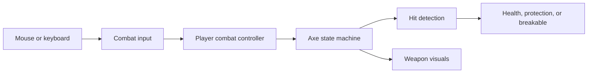

# Systems overview

[Player animation and previews](PlayerAnimation.md) · [World and tilemaps](World.md)

Road of the Old King separates input, gameplay state, presentation and persistence into focused components. The systems below describe the working PrototypeLoop mechanics unless stated otherwise.

**Current scope:** PrototypeLoop remains the default build scene; Tutorial is also enabled for scene reloads. Tutorial includes the animated player, camera, axe pickup, a throw-and-retrieve lesson at the practice stands, practice dummy, the Recall awakening (a thrown hit on the ancient sun-wheel stone unlocks Recall) and the first enemy/shard/bonfire setup. A step-based Tutorial guide teaches the route one hint at a time, completing each step from real outcomes (movement, pickup, throw/retrieve, dummy hits, dodge, awakening, a Recall drill, the first shard, resting) and saving progress. A contextual HUD shows health and stamina when relevant, interaction prompts beside objects, a weapon-away indicator, reward receipts and a Tab status panel. The overworld transition remains in development; the Tutorial currently ends at the exit trail. The published browser build predates the newer Tutorial presentation.

**Player animation:** the hero is drawn in eight directions at the world's 16 pixels per unit. `PlayerSpriteAnimator` samples gameplay state (travel distance, weapon action clocks, dash progress, stagger, health) and falls back to the directional standing views wherever an animation has not been supplied yet. Gameplay never waits on animation. See [player animation](PlayerAnimation.md) for the state slots, import pipeline and playback rules.

1. **World layout and collision.** `PrototypeLoop` (formerly `Tutorial`) uses the imported 16-by-16-pixel tiles for a linear practice route: pickup, dummies, bushes, cracked stone, Recall, return to the dummies, an enemy arena, a bonfire, a Recall puzzle, and a second fire beyond its door. A sample-map prefab supports tile experiments; `MovementPlayground` preserves the earlier movement test area. `PrototypeLoop` remains the default build entry.

   Visible tiles and physical boundaries are separate. Box colliders match the water surrounding the route, making barriers explicit and editable. Painting another water tile does not automatically add collision.

2. **Input, movement, and facing.** `PlayerMovementInput` converts WASD and arrow keys into a direction through `IMovementInput`. `PlayerMovement` applies that direction to a `Rigidbody2D` during physics updates, letting Unity handle obstacle collisions. Diagonal directions are normalized to keep speed consistent; a friction-free material helps the player slide along walls.

   All gameplay and movement-test scenes use the same finished `Assets/Prefabs/Player/Player.prefab`, including its artwork, animation and gameplay components. Movement and facing support eight directions, while weapon aim follows the mouse. `PlayerAimIndicator` draws a small outlined ivory chevron around the sprite using continuous cursor aim. It previews input aim even before equipping the axe; committed attacks retain their existing direction. It hides while controls are blocked. Center, radius, size and color are configured on the player prefab. Controls are keyboard and mouse only. Separating input from movement keeps key bindings out of movement rules.

3. **Camera follow and zoom.** `CameraFollow2D` smoothly follows a target after movement updates. It needs only the target's position, so it can follow objects other than the player. `CameraZoom2D` separately handles smooth scroll-wheel zoom, starting at size 5.5 and staying within 3-8 (Tutorial allows zooming out to 10). Smaller orthographic sizes show a closer view. Both components live on the reusable `FollowCamera` prefab, which every gameplay scene uses instead of its own camera.

   Hold **Left Alt** to look toward the cursor; release to smoothly return. `CameraLookInput` implements `ICameraLookInput`, while `CameraFreelook2D` supplies the offset and radial distance constraint (default three world units/tiles). `CameraFollow2D` remains the sole position writer and clamps the actual smoothed position relative to its normal follow center. Viewport-relative input avoids camera/cursor feedback drift and supports zoom and aspect changes. Focus loss, pause, disabled player controls and respawn clear freelook; held Alt must be released before restarting after interruption. The camera prefab includes these components; older standalone follow cameras compose them at runtime without rewriting scene assets.

4. **Weapon pickup and controls.** Approach a pickup and press **F**. `WorldPickup` separates availability from collection; the shared interaction handler selects one nearby item and shows its prompt. `AxePickup` equips the weapon through `PlayerCombatController`. One prefab instance serves as the ground pickup, held weapon, and projectile. Pickups take priority over bonfires, one per press; proximity alone never collects them. An already-owned thrown axe is the combat exception: walking over it retrieves it automatically, and Recall still catches automatically.

   Tutorial uses the independent standard `Axe.prefab`, drawn as an aged bronze halberd at the world's 16 pixels per unit. Its grounded pose stands planted upright in the chopping stump. Out of combat, `AxeView` hands the held weapon to the player's `PlayerWeaponCarry`, which stands it on the edge of the hero's right-side silhouette with per-facing mirroring and layering, a small cloak fold over the grip, and a bob that follows the body's walk frames. During actions it is placed half a unit along the aim with procedural swings. It runs after player animation (execution order 200 versus 100). Flight uses the complete drawn prop at native scale.

   `PlayerCombatInput` supplies actions through `ICombatInput`, including E press/held/release edges. The controller converts the cursor into a world-space aim direction, briefly remembers combo clicks, and commands `AxeWeapon`. Left click chains two sweeps and a thrust; holding and releasing right click performs a charged spin. Tap E for a quick throw; hold E to aim and release to throw. While aiming, RMB or an accepted dash cancels. E pressed while the weapon is away recalls it when unlocked; key-up after catching cannot throw it again. Focus/control loss, pause, stagger and death cancel a pending throw. The rejected E/RMB cycles cannot become delayed actions.

5. **Weapon actions and hit detection.** `AxeWeapon` uses a state machine: ground, held, chop, charge, cleave, flying, stuck, and returning states determine which actions are allowed. This prevents overlapping actions and disables melee while the weapon is away.

   The light combo uses a 160° opening sweep, a reversed 120° sweep and a straight halberd thrust, dealing 10/10/25 damage. The thrust reaches 30% further along a rectangular lane whose width is derived from a 28° angle at the tip. It has a longer windup and a 0.4-unit forward lunge applied through the player physics motor, preserving solid collision. Sweeping Edge widens only the sweeps and preserves their relative widths; a separate finisher damage multiplier supports future Deep Notch upgrades without widening the thrust. Existing stamina costs and combo/input windows remain unchanged.

   Only each attack's active window deals damage. Its footprint and weapon pose read the same per-step geometry and clock. A confirmed light hit pauses that clock for `lightHitPause` (0.045 seconds, 1.8x on the finisher), including the lunge; enemies and world time keep running. `AxeHitDetector` checks sweep sectors or the thrust lane and terrain obstruction. Flight checks the full distance traveled each physics step to catch obstacles between positions. Each target takes at most one hit per attack or flight leg. Outward throws stop on impact or at maximum range; returning throws can hit multiple targets. Tutorial throws travel at 12 units/second over 7 units; the prototype retains its original tuning. Control loss, stagger and defeat cancel light attacks and pending combo input.

   `ThrowActionClock` owns preparation, optional aim hold and release/recovery, separate from physical weapon ownership. The existing weapon physics step advances it once. `AxeSettings.throwAction` contains cel exposures and the launch-cel index; `ThrowCelIndex` supplies the current frame to the sprite presenter. Quick throws launch 120 ms after starting; prepared held throws launch 40 ms after key-up. Direction and the 25 stamina cost commit on valid key-up; the ground-plane origin is read at launch. Interrupted commitments retain the cost without spawning. The first flight step consumes only time after the marker, so a long frame cannot launch twice or skip anticipation.

   Aim permits world-relative movement at 55% walking speed, independently faces the cursor, suppresses sprint without spending sprint stamina and allows stamina recovery. Committed release briefly plants the player, then restores movement through recovery. `PlayerMovement` reads gameplay movement limits for throws and light swings from the weapon. The aim guide uses the flight sweep radius and stops at the nearest solid hit without damaging it. Throw presentation reads the clock's phase progress and launch fraction, so a drawn release frame of any animation length lines up with the physical launch.

6. **Health, protection, and reactions.** `CombatHit` carries damage, direction, impact position, knockback, stagger, and guard-breaking information to an `IHitReceiver`. `Damageable` manages health; `ShieldProtection` supplies protection through `IHitProtection`; `HitReaction` responds to accepted hits with knockback and stagger timing, and multiplies the knockback of a killing blow. Each axe attack's impulse and stagger are tuned on `AxeSettings`; enemies let the knockback slide out under physics damping, then take a short hit recovery before acting again.

   `Breakable` handles destructible props. Bushes accept ordinary hits, while shields and cracked stones require a full cleave to break. Separate target components let the same weapon interact with different objects without owning their internal rules.

   Returning axes can also bypass an intact shield by hitting the target's rear half. The shield compares the actual impact position with its facing direction, shown by the dummy's blue arrow. Front and exact-side Recall hits remain guarded. Rear hits deal ordinary Recall damage without breaking the shield; a special knockdown/stun is planned for later.

7. **Recall progression.** Picking up the axe leaves Recall locked. Players initially retrieve stopped throws by walking over them. Pressing F at the eastern altar makes `RecallUnlockPickup` call `PlayerCombatController.UnlockRecall()`; a future puzzle can call the same method.

   Once unlocked, E recalls the weapon toward the moving player, ignoring terrain so it can reach its owner. The same return starts automatically if an outbound or planted axe gets more than 10 units away from the player. This threshold exceeds both the prototype's 6-unit throw range and Tutorial's 7-unit range; it is adjustable in `AxeSettings.asset`. Automatic Recall uses the normal return damage and costs no extra stamina. Repeated unlock calls are harmless. Bonfire saves preserve equipment and Recall; loading restores them through the same player methods used during normal play.

8. **Feedback, practice targets, and tuning.** `AxeMeleeFeedback` displays light-attack reach on the ground plane: a faint boundary during windup, a soft filled footprint during the active damage window, and no tail during recovery. Sweeps use sectors with a moving ivory crescent; the finisher uses a straight thrust lane. It reads the same action clock, committed direction, effective reach and arc as melee hit detection, including upgrades, finisher reach and hit pause. The full sector is active at once; the crescent communicates motion rather than a moving hitbox. The effect always draws the full footprint without terrain collision queries; it can extend across walls, while actual damage remains blocked by terrain. Actual hits still use target collider closest points, guard rules and once-per-swing deduplication. The cursor chevron continues to show input aim independently of the committed swing. `AxeView` supplies held/flight presentation, charge indicators and trails. `AxeComboIndicator` shows the current combo hit with three small pips above the player. `TutorialCombatHUD` now displays prototype instructions, player health and stamina, charge progress, controls, and a defeat/restart prompt. `PracticeTarget` adds health labels, hit flashes, and a four-second reset after defeat, restoring health, position, and shields. Practice dummies remain separate from the actual enemy.

   Prefabs store reusable object setups. `AxeSettings.asset` is a ScriptableObject: an asset holding attack timing, damage, stamina costs, range, and flight speeds separately from behavior. The standard Axe uses it across gameplay; `PrototypeAxeSettings.asset` preserves the older PrototypeAxe tuning. Combat can therefore be tuned in the Inspector without changing code.

9. **Player health and defeat.** The player reuses `Damageable` with 100 base health and `HitReaction` for knockback. `PlayerHealth` implements `IHitProtection` to reject damage for 0.8 seconds after a hit, and consults `PlayerDash` for the brief dodge window. Movement lets knockback run during stagger. Defeat stops player controls and cancels active axe damage. R or the defeat button reloads the scene at the last bonfire with full health/stamina and permanent progress intact. Before the first fire, defeat returns to the starting position while retaining permanent progress.

10. **Simple enemy.** `SimpleMeleeEnemy` notices the player, approaches, locks its attack direction, winds up for 0.65 seconds, strikes for 20 damage, then recovers for 0.9 seconds. Range, angle, and line-of-sight checks prevent hits outside the attack or through walls. Weapon stagger interrupts attacks, and the enemy returns home if the player leaves its area. `MeleeEnemyView` separately draws the warning arc, colors, and status label. Its reusable `MeleeSentinel` prefab has 100 health and resets when resting, travelling, or respawning.

   The production `Wolf.prefab` reuses this behavior with a separate `WolfView` presenter and `WolfAnimationSet`. Twenty 48x48 sprites cover idle, movement, crouch/bite and directional corpses; west mirrors east. Gait advances with actual travel, while attack/recovery presentation samples enemy state and progress. Stagger and death reuse the crouch, followed by a held corpse; gameplay defeat and rewards occur immediately. Rest resets the presentation with health and collision. The original MeleeSentinel remains available for the prototype. `EnemyImpactFeedback` on enemies and practice targets plays a short impact clip and capped directional pixel particles (whole world pixels) from accepted damage events; contact geometry comes from `CombatHit`, and rest/disable clears transient effects. A killing blow throws a larger burst with a deeper sound and a brief global freeze (`HitStop`, which acts only at normal time scale), and the corpse slides with the blow's knockback, stopping at terrain, before settling into its death pose. Both enemy prefabs carry `EnemyHealthIndicator`: a rounded two-tone red bar above the sprite, reading current/max `Damageable` health directly, hiding on defeat and returning on restoration. `EnemyAwarenessIndicator` briefly shows an outlined ivory/gold pixel `!` above the wolf when it detects or reacquires the player. It stays centered above the sprite and clears on loss of awareness, defeat or reset; ordinary attack transitions do not retrigger it. [Native wolf atlas](Art/Enemies/Wolf.png).

   Tutorial's first-enemy integration retains 60 health, 10 damage, a 0.8-second windup and a slower approach. Its first enemy unlocks one persistent Sun Shard pickup, followed by a roadside bonfire. A separate save key isolates Tutorial progression from PrototypeLoop. The shared HUD supports a compact health/stamina/shard display while retaining rest and defeat controls.

11. **Prototype teaching route.** `PrototypeLoopGuide` listens for actual dummy hits and checks pickup, retrieval, broken props, Recall, enemy defeat, bonfire discovery, and puzzle completion. It supplies one current instruction and opens route gates as lessons are completed. The first fire follows the enemy arena; the second sits beyond the puzzle door. Saved milestones keep completed lessons open when enemies reset. This sequence belongs to the prototype scene rather than the weapon or enemy systems.

12. **Bonfires and travel.** Approach a fire and press **F** to light/rest at it: restore health and stamina fully, retrieve the axe, clear stagger, reset enemies/dummies, save, and set the respawn location. `PlayerBonfireInteraction` handles the nearby interaction and locks movement/attacks while the menu is open; F or Escape leaves it. After discovering both fires, their menus offer travel between them. `Bonfire` holds each fire's stable ID and safe spawn point, while `BonfireView` draws its placeholder flame and label. The prototype's second fire also offers the implemented three-shard axe upgrade menu described below.

13. **Throw/Recall puzzle.** Stand on the gold floor mark and throw at the gold target to arm the mechanism. Move to the blue floor mark and recall through the blue target to open the door. `AxePuzzleTarget` receives the existing `CombatHit` data through `IHitReceiver`; `ThrowRecallPuzzle` enforces the throw-then-return sequence and tells `PuzzleDoor` to open. Melee, an outbound hit on the blue target, or Recall before arming cannot solve it. Rest resets an unfinished attempt, while a completed door remains open.

14. **Checkpoint saves and world resets.** `CheckpointSession` keeps progress across scene reloads. `IProgressParticipant` lets the guide, puzzle, altar, and cleared route obstacles capture/restore their own state; `IResetOnRest` lets ordinary enemies and dummies reset independently. `PlayerPrefsProgressStore` stores a small versioned JSON record locally, behind `IProgressStore`. Saves contain equipment, Recall, checkpoint/fire IDs, cleared obstacles, route milestones, completed puzzles, collected rewards, shard balance, and weapon choices. Initial equipment pickup, Recall unlock, puzzle completion and reward collection save immediately without changing the checkpoint; death preserves permanent progress even before the first rest. A fresh launch resumes the saved fire, or the starting position if none has been discovered, with saved equipment restored. A new run starts without the axe. **New run...** in a fire menu asks before clearing the current save slot.

15. **Sprint and stamina.** Hold **either Shift key** while moving to sprint at 7.2 units/second instead of 4.5. `PlayerMovementInput` supplies sprint intent through `IMovementInput`; `PlayerMovement` applies speed and spends stamina only while sprinting. Melee and charging allow walking but stop sprinting. At exhaustion, movement returns to walking and needs 18 stamina to start sprinting again. Stagger, focus loss, disabled controls, fire menus, and death stop sprinting. The Back to Dummies trail sign introduces Shift sprint on the return walk.

    `PlayerStamina` owns a 100-point pool and recovers 25 points/second after 0.5 seconds without spending or performing melee. `AxeWeapon` asks the small `IStamina` interface to pay before changing action state. Failed or overlapping actions do not spend stamina or advance the combo. Cleaves pay once when charging begins, including cancelled charges; holding a charge cannot recover that cost. Throwing pays for the round trip, so Recall and on-foot retrieval remain free. Rest, travel, and respawn restore stamina; it is not permanent save data. The HUD shows the pool, turns amber below 25%, and flashes red when an action is unaffordable.

    Initial combat values are a tuning baseline, not a finished balance:

    | Action | Damage | Stamina cost |
    | --- | --- | --- |
    | Light combo | 10 / 10 / 25 | 18 / 18 / 24 |
    | Full charged cleave | 30 | 35 |
    | Throw | 15 | 25 |
    | Recall return | 10 | Free; included in throw |
    | Sprint | None | 18 per second |
    | Short dash / dodge | None | 25 |

    Player, sentinel, and practice dummies have 100 HP; the sentinel hits for 20. One full combo costs 60 stamina and deals 45 damage. Continuous slashing exhausts the player before killing the sentinel, creating a reason to disengage and recover.

16. **Short dash / dodge.** Tap **Space** to dash 3 units over 0.18 seconds, spending 25 stamina. Direction locks to current movement, or the last facing direction while standing still; diagonals travel the same distance. Only the opening 0.1 seconds blocks damage, followed by an exposed ending and a 0.15-second cooldown after the dash. The sentinel arena sign and HUD teach the control.

    `PlayerDash` owns timing, direction, and cost. `PlayerMovement` remains the only component that applies player movement velocity, so sprint, dash, knockback, and wall collision cannot fight over the Rigidbody. Input remembers a short Space tap until the next physics step and consumes it once; holding Space does not repeat dashes. Attacks and dashes cannot start over one another, but Recall remains available while dodging. Stagger, disabled controls, focus loss, and defeat cancel the dash. Rest and travel reset its cooldown and refill stamina; respawning creates a fresh dash state.

17. **Sun Shards and axe upgrades.** PrototypeLoop contains three one-time rewards: a pickup dropped when the sentinel falls, an immediate award for solving the throw/Recall puzzle, and a pickup on the optional north trail beyond the puzzle door. Press **F** near gold shards to collect them. The HUD shows unspent shards. At the second bonfire, press **F**, open **Axe upgrades**, review three choices, then confirm one for **3 Sun Shards**. The other two choices disappear for that run.

    | First-tier choice | Effect | Unchanged |
    | --- | --- | --- |
    | Quick Hands | 20% faster light slashes and recovery; first two swings take 0.25 seconds | Damage, stamina per swing, reach |
    | Sweeping Edge | Sweeps widen from 160/120 degrees to 180/135 degrees; thrust stays unchanged | Forward reach, damage, timing, stamina |
    | Wide Cleave | Charged cleave radius grows from 2.1 to 2.6 units | Damage, charge time, stamina |

    These values are a starting point for balance testing. `SunShardReward` listens to enemy defeat or puzzle completion, independently of their combat logic. A reusable prefab supplies the pickup trigger and gold placeholder. Stable reward IDs record both availability and collection; an uncollected sentinel drop survives a reload, and killing a revived sentinel never produces another reward. Collected shards, spending, and upgrades survive rest, death, travel, and game reload. Rewards save even before the first bonfire; a death there returns the player to the start while keeping saved progress. New run clears progression.

    `AxeUpgrade` assets describe each choice; `AxeUpgradeTier` groups choices and sets the price. `WeaponUpgradeProgression` owns sequential tier selection, affordability, and permanent exclusions without depending on menus or storage. `CheckpointSession` validates the open bonfire and player before saving the purchase. `BonfireUpgradeMenu` only presents the options. The weapon rebuilds its effective stats from saved selections, and its visuals use those same stats. Shared base settings are never modified, so reloading cannot accidentally stack a bonus twice or change other weapons.

    Upgrade tiers are data assets, and existing stat effects combine across tiers. New flight behaviors would require additional gameplay code; purchase and persistence are independent of those behaviors. Old version-one saves load with zero shards and no upgrades; already solved puzzles grant their reward on restoration, and the sentinel can be defeated again to earn its new reward.

18. **Heart fragments.** Three optional red heart pickups sit beside the practice area, in the Recall clearing, and near the second bonfire beyond the puzzle door. Press **F** near them to collect them. Every **3 fragments permanently add 20 maximum HP**, taking the prototype player from 100 to 120. Completing a set also fills the newly added 20 HP; partial sets do not heal. The HUD shows fragments toward the next set and the permanent HP bonus. The first pickup has a short teaching sign.

    `HeartFragmentPickup` checks reach and player health, then commits collection and hides its visual/trigger. `HeartFragmentProgression` derives fragment count and health bonus from unique IDs in the existing save record, so there is no separate saved counter to become inconsistent. `CheckpointSession` records each collection immediately, even before the first bonfire. `PlayerHealth` restores the derived bonus through the existing progress-participant interface. `Damageable` supports an absolute runtime health bonus while keeping its configured base HP unchanged; repeated restoration neither stacks bonuses nor heals the player again.

    Pickups stay collected through rest, travel, death, and reload. Rest and respawn fill the increased capacity. New run resets fragments and maximum HP to the original 100. Existing saves need no migration. More sets can use the same prefab and rules with new stable reward IDs; each additional complete set adds another 20 HP.

19. **Tilemap world.** Tutorial uses native 16 x 16 tiles with separate visual and collision layers. Unity RuleTiles choose edges and corners from neighboring cells; AnimatedTiles handle four-frame ripples and waterfalls. Static object prefabs separate ground-level art, overhead portions and solid footprints. Python generators and Unity Editor builders produce ordinary Unity assets, with no generation code in the running game. See [world and tilemaps](World.md) for connection shapes, rendering layers and previews.

The design follows SOLID principles through focused responsibilities, small interfaces, and events. Interfaces define what a component provides or accepts. Events let health notify reaction and feedback components when damage occurs. For example, adding another object that implements `IHitReceiver` does not require changing player controls.

## Combat effects inspection

The Unity editor menu **Road of the Old King > Combat > Combat Effects Preview** opens a practice tool using the standard Player and Axe. It can replay a chop, three-hit combo, charged cleave or throw/Recall, with adjustable direction, target distance and a blocking wall. The viewport and readouts expose the live attack phase, light-melee reach, arc, timing and confirmed hits.

Game speed ranges from 0.05x to 1x. Editor pause preserves the current animation and effects; frame stepping advances one Unity frame at the chosen speed, and automatic pause can catch the first active light-melee frame. Slow motion retains the game's physics timestep and original audio pitch; audio pauses with the preview and can be muted.

Practice runs in a separate editor launch scene without a checkpoint/save session. Stopping restores the previously open scenes. Closing the tool or leaving Play Mode restores the time, audio and background settings it took over. During an ordinary gameplay session the window offers time controls and inspection; scripted practice actions require its dedicated preview session. The preview driver is excluded from player builds.

## Key implementation files

| Responsibility | Source |
| --- | --- |
| Movement, sprint, momentum (eased start/stop, wall rebound) and velocity ownership | [PlayerMovement](../RoadOfTheOldKing/Assets/Scripts/Player/PlayerMovement.cs) |
| Weapon action state and ownership | [AxeWeapon](../RoadOfTheOldKing/Assets/Scripts/Weapons/AxeWeapon.cs) |
| Aim, release and throw timing | [ThrowActionClock](../RoadOfTheOldKing/Assets/Scripts/Weapons/ThrowActionClock.cs) |
| Player sprite presentation | [PlayerSpriteAnimator](../RoadOfTheOldKing/Assets/Scripts/Player/PlayerSpriteAnimator.cs) |
| Tutorial steps and hints (data-driven, saved as milestones) | [TutorialGuide](../RoadOfTheOldKing/Assets/Scripts/Tutorial/TutorialGuide.cs) |
| Contextual HUD: vitals, prompts, receipts, hint, status (presentation only) | [GameHud](../RoadOfTheOldKing/Assets/Scripts/UI/GameHud.cs) |
| Shared in-combat signal for presentation | [EncounterState](../RoadOfTheOldKing/Assets/Scripts/Combat/EncounterState.cs) |
| Movement dust: speed-scaled trail and inertia skid clouds (presentation only) | [PlayerMovementDust](../RoadOfTheOldKing/Assets/Scripts/Player/PlayerMovementDust.cs) |
| Checkpoints and persistent progress | [CheckpointSession](../RoadOfTheOldKing/Assets/Scripts/Progression/CheckpointSession.cs) |
| Upgrade selection and exclusions | [WeaponUpgradeProgression](../RoadOfTheOldKing/Assets/Scripts/Progression/WeaponUpgradeProgression.cs) |

## Pause menu

The Player prefab includes an Escape pause menu with Restart and Quit. Escape resumes; arrows/Enter and mouse activate commands. Restart reloads the current scene at the saved checkpoint (or start), preserving permanent progress. Quit exits a native build or stops Editor Play Mode; browser builds explain that the tab must be closed. Escape dismisses a bonfire menu before offering pause, and the existing defeat screen retains restart ownership after death.

`PauseMenuInput`, `PauseMenuController`, command objects and `PauseMenuView` separate bindings, modal state, actions and UI Toolkit presentation. The placeholder UXML/USS uses a charcoal panel and ivory/gold accents; art can change without rewriting gameplay. `SimulationPause` leases coordinate menus, hit stop and combat-preview time control. Closing restores the previous speed/audio and only the inputs the menu disabled, with a frame of protection against accidental gameplay clicks.

## Verification

Focused checks cover combat, stamina and dodge; throw input and release timing; Recall; player animation selection; progression and save restoration; and tile connections, collision separation and route clearance.

The [verification source](../Tools/Verification) contains Unity Editor-executed C# snippets grouped by Gameplay and World. These are focused integration fixtures rather than an automatically discovered continuous-integration suite. Preview recordings demonstrate presentation; they do not establish completion of Tutorial progression.
