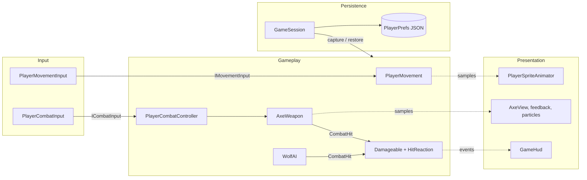
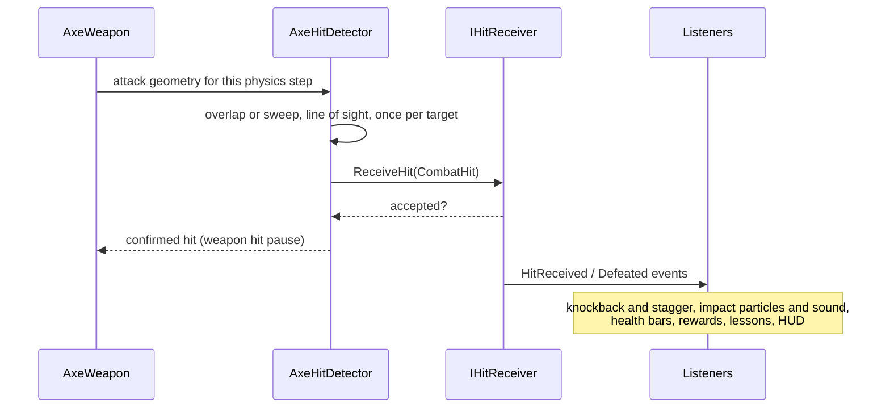
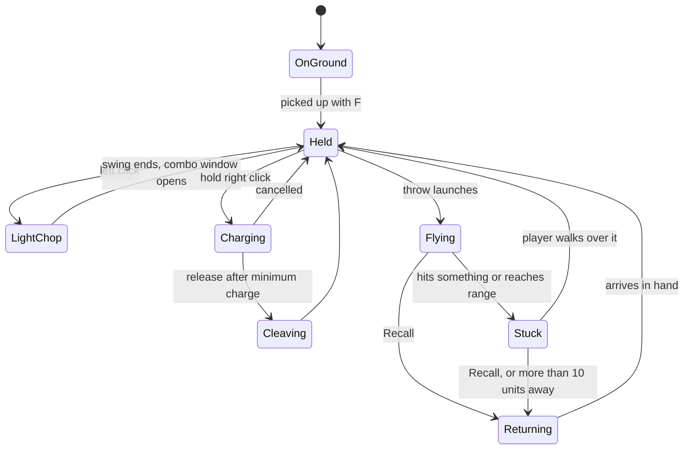
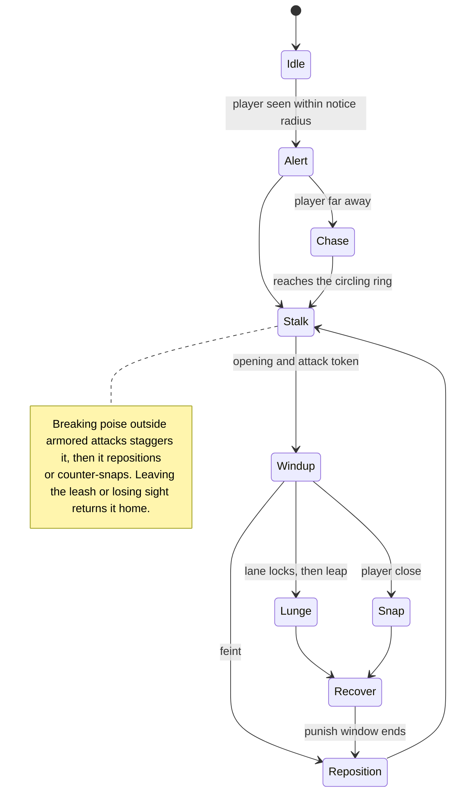
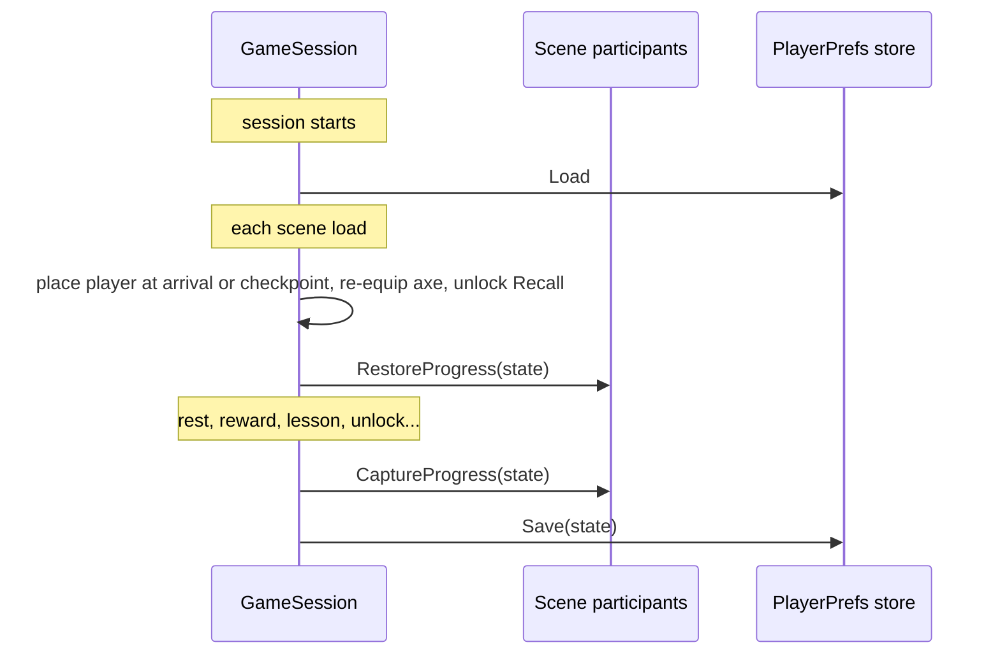
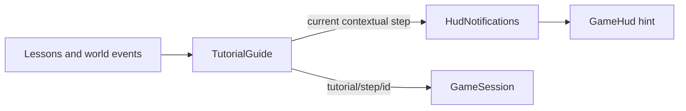

# Systems overview

[Player animation](PlayerAnimation.md) · [World and tilemaps](World.md) · [Changelog](../CHANGELOG.md)

This guide explains how Road of the Old King works at runtime: its major systems, which component owns what, and how they communicate. It describes the production game in `Tutorial.unity`, the only scene in the build. `PrototypeLoop.unity` is a retired mechanics sandbox kept for reference, and `MovementPlayground.unity` is a small movement test scene.

**Status:** the Tutorial is playable end to end: movement, axe pickup, throwing, melee, the first wolf, healing, the Recall awakening, a wolf pack, a Sun Shard and a bonfire. The route ends at the exit trail; the first overworld region (Green Lowlands) and the transition into it are in development. HUD and menus use the shared pixel font and frames.

[Architecture](#architecture) · [Player](#player) · [Combat](#combat) · [Enemies](#enemies) · [Progression and saving](#progression-and-saving) · [World and interaction](#world-and-interaction) · [Tutorial](#tutorial) · [Camera](#camera) · [Presentation and UI](#presentation-and-ui) · [Tools](#tools-and-verification) · [Limitations](#current-limitations) · [Key files](#key-files)

## Architecture

One rule runs through the codebase: **gameplay owns state; presentation only samples it.** Each mechanic has a single owner component, and everything else reaches it through small interfaces and C# events.

- **Single writers.** `PlayerMovement` is the only component that sets the player's velocity, `CameraFollow2D` the only one that moves the camera, and `PlayerSpriteAnimator` the only one that sets the body sprite. Dash, knockback, attack lunges and freelook feed these writers instead of competing for the component.
- **Input behind interfaces.** Movement, combat and camera look read `IMovementInput`, `ICombatInput` and `ICameraLookInput`. Bindings live in small adapter components.
- **Hits are data.** Attacks deliver a `CombatHit` value to any `IHitReceiver`. A weapon never knows what kind of object it struck.
- **Events for reactions.** `Damageable` raises `HitReceived` and `Defeated`. Knockback, particles, health bars, rewards, lessons and the HUD subscribe without the health component knowing about them.
- **Progress through participants.** Anything persistent implements `IProgressParticipant`, and anything that resets at a bonfire implements `IResetOnRest`.
- **Tuning in data.** Weapon stats, upgrades and animations are ScriptableObject assets. Scenes hold placement and per-instance overrides only.

| `Assets/Scripts/` | Responsibility |
| --- | --- |
| `Input` | Keyboard and mouse adapters behind interfaces |
| `Player` | Motor, stamina, dash, health, combat controller, interaction, animation |
| `Weapons` | Axe state machine, hit detection, throw clock, settings, upgrades, weapon visuals |
| `Combat` | Hit data, health, reactions, protection, enemy AI and presentation, encounter signal |
| `Camera` | Follow, zoom, freelook |
| `Progression` | Checkpoint session, save format and store, upgrades, heart fragments |
| `World` | Pickups, bonfires, rewards, puzzle pieces |
| `Tutorial` | Lessons, Recall awakening, guide, exit |
| `UI` | HUD, notifications, menus, time control, F3 Debug Panel and F4 Developer Tools |
| `Prototype` | Code for the retired PrototypeLoop (its guide, legend and placeholder views) |

Code lives under `RoadOfTheOldKing.*` namespaces. Rendering uses the Universal Render Pipeline with its 2D Renderer; sprites currently use unlit materials, so 2D lighting is available for a later atmosphere pass.

## Player

`Player.prefab` is one self-contained prefab shared by every scene. The axe is a separate prefab placed in the world; the player equips it on pickup.

| Role | Components |
| --- | --- |
| Input | `PlayerMovementInput`, `PlayerCombatInput` |
| Motor | `PlayerMovement`, `PlayerDash`, `PlayerStamina`, `PlayerControlLocks` |
| Combat and health | `PlayerCombatController`, `PlayerHealth`, `Damageable`, `HitReaction`, `PlayerFlask` |
| Interaction | `PlayerBonfireInteraction` (pickups and bonfires) |
| Presentation | `PlayerSpriteAnimator`, `PlayerWeaponCarry`, `PlayerAimIndicator`, `PlayerMovementDust`, `PlayerHitFeedback` |
| UI | `GameHud`, pause menu (`PauseMenuInput`, `PauseMenuController`, `PauseMenuView`), `BonfireMenu`, `DefeatScreen` |

### Controls

Keyboard and mouse today; Xbox controller support is planned and not yet implemented.

| Input | Action |
| --- | --- |
| WASD / arrow keys | Move |
| Shift (hold) | Sprint |
| Space | Dash / dodge |
| Left click | Light combo: sweep, reverse sweep, thrust |
| Right click (hold, release) | Charged cleave |
| E | Tap to throw, hold to aim and release to throw; while the axe is away, Recall |
| Q | Drink a healing flask |
| F | Pick up, rest at a bonfire |
| Tab | Status panel |
| Alt (hold) | Look toward the cursor |
| Mouse wheel | Zoom |
| Esc | Pause |
| F3 / F4 | Debug Panel / Developer Tools (Editor, development and browser builds) |

### Movement

`PlayerMovement` runs each physics step and decides, in priority order, what drives the `Rigidbody2D`:

1. **Stagger:** the knockback impulse plays out; input is ignored.
2. **Controls lost** (menu, awakening lock, focus loss, death): the body stops.
3. **Dodge:** a fixed 3.2 units over 0.36 s, in a locked direction.
4. **Weapon action:** attacks and throws scale walking speed, and the finisher adds its lunge.
5. **Free movement:** momentum eases the body toward the input velocity (walk 4.5 u/s, sprint 7.2 u/s) with separate acceleration, stopping and turning rates. Hard sprint impacts with static walls bounce slightly.

All of these write velocity rather than the Transform, so every kind of movement collides with walls. Momentum starts from the body's collision-resolved velocity, which stops slides at walls instead of letting them push through.

### Stamina, dash and defence

- **Stamina** (`PlayerStamina`): a 100-point pool that works like Dark Souls. Any action can start while stamina is above zero, and its cost may push stamina into a deficit (down to −40), which lengthens the wait; an attack made that way deals 60% damage and swings 25% slower. Recovery runs at 40/s after 0.6 s and pauses during attacks, dodges and sprinting. Sprinting drains 18/s, stops at zero and needs 18 to start. The HUD bar turns dark red while in deficit.
- **Dodge** (`PlayerDash`): costs 18 stamina and has no cooldown; stamina is the only limit. Its first 0.24 s is invincible. Attacks and dodges can't interrupt each other, but Recall works mid-dodge.
- **Healing flasks** (`PlayerFlask`): three charges, refilled at a bonfire or on respawn. A drink is a commitment, as in Dark Souls: the charge is spent at once, you walk slowly and can't attack or dodge, the heal (40) lands late in the 0.9 s drink, and a stagger before then wastes it. Enemies treat drinking as an opening.
- **Defence** (`PlayerHealth`): the player's `IHitProtection` on the shared `Damageable`. It rejects hits during the dodge window and for 0.8 s after taking damage. On defeat, controls stop and the defeat screen restarts from the last checkpoint.

## Combat

### Hits

Every attack, player or enemy, is a `CombatHit` delivered to an `IHitReceiver`.

- `CombatHit` carries the source, attack kind (light, cleave, throw, Recall, enemy melee), damage, direction, knockback, stagger, a guard-break flag and the impact point.
- `AxeHitDetector` resolves the geometry.
  - **Melee:** overlaps are filtered by the swing's arc or thrust lane, and a line-of-sight check means walls protect targets.
  - **Flight:** a circle cast sweeps the whole distance travelled each step, so fast throws can't pass through objects between frames.
  - Each target is hit at most once per attack or flight leg.
- Receivers decide what a hit means:
  - `Damageable`: health, with an optional `IHitProtection` such as `ShieldProtection`;
  - `Breakable`: props, optionally cleave-only;
  - `AxePuzzleTarget`, the practice stands and the Recall stone.

  A new kind of hittable object never needs a change to the weapon.
- Only accepted hits raise events, so blocked, duplicate or already-dead hits produce no feedback.

### The axe

`AxeWeapon` is a single state machine that owns the weapon on the ground, in hand, mid-swing and in flight. The state decides which actions are legal, so melee is impossible while the axe is away and actions never overlap.

- **Throw timing:** the throw has its own clock (`ThrowActionClock`) layered over `Held`: prepare, optional aim hold, launch, recovery. A tap on E launches 120 ms after the press. Holding E aims while walking at 55% speed, and the release launches 40 ms later. Right click or a dash cancels the aim.
- **Throw cost:** stamina is spent on release (20). A Recall you trigger costs 10 and is refused with no stamina left, so the axe must be fetched on foot; on-foot retrieval and automatic Recall are free. Catching the axe leaves a 0.25 s opening with no attack, throw or dodge.
- **Recall:** locked until the Tutorial's awakening. Once unlocked, E pulls the axe back toward the player through terrain, damaging anything on its path. An axe that ends up more than 10 units away returns on its own.

### Attacks

| Attack | Shape | Damage | Stamina |
| --- | --- | --- | --- |
| Light 1 / 2 | 160° sweep, then a reversed 120° sweep; reach 2.6 | 10 / 10 | 16 / 16 |
| Light 3 (finisher) | Straight thrust lane at 1.3x reach, with a 0.7-unit lunge | 25 | 24 |
| Charged cleave | 360° spin, radius 2.1; a full charge breaks guards | up to 30 | 35 |
| Throw | Flies 7 units at 12 u/s and sticks in what it hits | 15 | 20 |
| Recall | Returns at 16 u/s, hitting everything on its path except the target it is pulled out of | 10 | 10 |

These values live in `Assets/Settings/Weapons/AxeSettings.asset` and are a tuning baseline, not final balance.

- **Timing.** Each melee attack runs on the weapon's action clock: windup, active, recovery. Only the active window deals damage. The ground footprint (`AxeMeleeFeedback`), the weapon pose and future body animations read that same clock and geometry, so what the player sees is what hits.
- **Hit pause.** A confirmed light hit pauses only the weapon's clock: 0.045 s, or 1.8x on the finisher. Enemies and the world keep moving. A killing blow adds a brief global freeze (`HitStop`, 0.08 s).
- **Input feel.** Clicks are buffered for 0.25 s and chain within a 0.55 s combo window. Light attacks never root you: you keep at least 55% of walking speed. The charged cleave is the heavy attack: from half charge through the spin it has hyper-armor, so hits still hurt but cannot interrupt it. Control loss, stagger, pause and death cancel pending attacks and throws, and a lost key release cancels a throw rather than firing it.
- **Upgrades.** `AxeWeapon.ApplyUpgrades` rebuilds effective stats from the saved selections and never edits the shared settings asset, so reloading can't stack a bonus twice.

### Reactions

`HitReaction` turns accepted hits into stagger and a physics knockback impulse. Knockback slides out under damping instead of stopping dead, and a killing blow pushes 1.6x harder. Enemies can have **poise**: damage accumulates and only staggers once it passes a threshold (the meter resets after a pause; thrown and Recall hits count half), and an AI can switch on **hyper-armor** during committed attacks. Hits that don't stagger keep only a nudge of knockback. The player and practice dummies have no poise, so every staggering hit staggers them. Feedback listens to the same events:

- `EnemyImpactFeedback`: impact sound and whole-pixel particles at the contact point;
- `WoodTargetFeedback`: wood chips and sound on practice targets;
- enemy health bars and hit flashes.

## Enemies

Enemy AIs implement `IEnemy` (aware, defeated, reset, a `PlayerDetected` event) and register themselves in `EnemyRegistry`, so shared systems such as the combat signal, the "!" cue, impact effects and the F3 panel work with any enemy without searching the scene.

`WolfAI` is the wolf's brain. Its rhythm is **stalk, commit, punish, reposition**:

- **Stalk:** circles the player at a distance, reversing when blocked, which leaves openings for throws and Recall.
- **Lunge:** the main attack. The windup tracks the player, then the direction **locks** and the wolf leaps along a lane drawn on the ground (thin while tracking, thick once locked, red while active), so a sidestep after the lock avoids it. Some windups are feints that break off.
- **Snap:** a quick bite if the player stays close.
- **Recover:** a short pause after every attack, the player's punish window, before it trots back out to the ring.
- **Reading the player:** it sidesteps an axe thrown straight at it, runs at a player whose axe is away, hops back from swings, attacks at once when the player whiffs or throws the axe away, presses a tired player, and bites back when a hit fails to break its poise. Lunges are armored, and windups vary in length while the lock always comes a fixed beat before the leap.
- **Packs:** `AttackTokens` lets one enemy attack at a time while the others keep circling, spaced apart.

`WolfView` samples the AI: circling, repositioning and chasing use stalk, walk and run animations driven by distance travelled; the bite's frames follow the windup clock so the jaws open on the leap; death plays once and holds as the corpse. The wolf also carries `EnemyHealthIndicator`, `EnemyAwarenessIndicator` and `EnemyImpactFeedback`. `EncounterState` is the shared "in combat" signal: true while any registered enemy is aware of the player or the player was just hit, plus 3 s of grace.

The prototype `SimpleMeleeEnemy` (approach, windup, single strike, recovery) remains for the retired PrototypeLoop sentinel.

## Progression and saving

`GameSession` is one game-level session for every scene. Each playable scene contains the `GameSession` prefab so it can be played directly; the first instance survives scene loads through `DontDestroyOnLoad`, and later copies remove themselves, so the save key and upgrade tiers always come from the prefab. It owns the player's permanent progress and writes it through `IProgressStore` as one versioned JSON record in PlayerPrefs, which also works in the browser build. Two services hang off it: `CheckpointService` (rest, travel, scene exits, respawn and placing the player on load) and `RewardService` (Sun Shards, heart fragments and upgrade purchases).

- **Versions.** `ProgressMigrations` reads any known save version and upgrades it step by step. Version 2 (0.4.8) replaced the per-scene Tutorial save; on first launch the old record is migrated into the game-wide key and kept as a backup until New Game.
- **Scene changes.** `SceneTransitions`, on the session, fades out with the world frozen and input locked, loads the scene and fades back in. The session places the arriving player at a named `SceneSpawnPoint` (or a fire, for travel), otherwise at the checkpoint fire if it is in that scene.
- **Exits.** `SceneExit` is a trigger with a target scene and spawn id. It saves, carries current health and flask charges across, and can record a milestone on first use. With no target it only shows its notice; the Tutorial exit works this way until Green Lowlands exists.
- **Resume point.** `ResumePoint` (scene, position, health, flasks) is a small record beside the save. It is written when the player pauses, leaves to the title, quits or the window loses focus, and by a throttled autosave (every 5 s, only when alive, out of combat and moved). Death, resting, travel, Return to bonfire, scene exits and New Game clear it.
- **Title.** The game starts in the `Title` scene. Continue resumes at the resume point if there is one, otherwise at the checkpoint's fire (or the new-game scene's start without a checkpoint); New Game clears the save, confirming first when one exists; the pause menu's Main Menu saves and returns there.
- **The axe.** Taking the axe from the Tutorial stump is a one-time pickup. Once the save owns it, `PlayerCombatController` spawns the player's own copy from its `ownedAxePrefab` on every scene load, and an unowned world axe with `AxePickup` hides itself.

**What's saved (`ProgressState`):**
- axe ownership and the Recall unlock;
- the last checkpoint and its scene, plus discovered fires with their scenes (so travel can list fires in other scenes);
- the Sun Shard balance and chosen upgrades;
- a list of completed string IDs.

The ID list holds most progress: lessons, collected rewards, guide steps and solved puzzles, for example `tutorial/lesson/melee`, `shard/collected/<rewardId>`, `tutorial/step/<id>` and `tutorial/complete`. IDs are permanent; renaming one that has shipped orphans saved progress.

**Participants.** The session doesn't know how objects represent their state. On capture, each `IProgressParticipant` writes itself into `ProgressState`; after a scene loads, each one restores itself from it.

| Event | Checkpoint | Heals and resets enemies | Saves | Reloads scene |
| --- | --- | --- | --- | --- |
| Rest at a bonfire | Set to that fire | Yes | Yes | No |
| Permanent gain (axe, Recall, shard, fragment, lesson, puzzle) | Unchanged | No | Yes | No |
| Quit, Main Menu, pause, or the window losing focus | Unchanged | No | Resume point only | No (Continue later loads the exact spot) |
| Leave through a scene exit | Unchanged | No (health and flasks carry over) | Yes | Loads the target scene at its spawn point |
| Death or Return to bonfire | Unchanged | Through the reload | Yes | Yes: the checkpoint's scene at its fire, or this scene's arrival point without a checkpoint |
| New Game (title screen, confirmed over a save) | Cleared | Through the reload | Save deleted | Yes, the new-game scene |

**Rewards and upgrades**
- **Sun Shards** (`SunShardReward`): a pickup that an event can unlock, such as an enemy's `Defeated` (or a whole pack's, with `alsoDefeat`) or a puzzle's `Solved`, or that is simply placed. Collecting it records `shard/collected/<id>` and adds to the balance, so each reward is one-time even though enemies come back.
- **Upgrades** (`WeaponUpgradeProgression`): tiers of three mutually exclusive choices, defined as `AxeUpgradeTier` and `AxeUpgrade` assets. Buying one for 3 shards at a bonfire that offers upgrades removes the other two for the run. Tier one:
  - **Quick Hands:** light attacks 20% faster.
  - **Sweeping Edge:** sweeps widen to 180° / 135°.
  - **Wide Cleave:** cleave radius 2.1 → 2.6.
- **Heart fragments:** every three collected add 20 maximum HP. The count is derived from collected IDs rather than stored separately, so it can't drift. The mechanic is complete but not yet placed in the Tutorial.

## World and interaction

- **Tilemaps.** Visual layers are separate from an invisible Collision map, and canopies and roofs draw on an Above Player layer. Elevation is visual only; everything shares one physics plane. See [World and tilemaps](World.md).
- **Gameplay objects** live under `Tutorial Zone/Interactive Objects`, usually as prefab instances. The Recall seal combines scene-authored tilemaps with a gameplay component and collision.
- **Interaction (F).** `PlayerBonfireInteraction` is the single interaction selector.
  - It picks one nearby `WorldPickup` (axe, shard, heart fragment) first, otherwise a nearby bonfire. One press commits one thing.
  - The HUD prompt reads the same selection, so it always matches what F will do.
  - Proximity alone never collects, with one exception: an axe the player already owns is retrieved by walking over it.
- **Bonfires.** `Bonfire` holds a stable ID, a display name and a spawn point. Resting heals, refills stamina, returns the axe, resets enemies, sets the respawn point and saves. Discovered fires offer travel between them, including fires in other scenes; travel saves and respawns at the destination.
- **Puzzle pieces.** `AxePuzzleTarget` turns hits into puzzle input. `ThrowRecallPuzzle` requires an outbound throw into its anchor, then a Recall through its switch, and can open a `PuzzleDoor`.

## Tutorial

The route teaches one verb per space, and each lesson completes from a real outcome rather than a key press.

| Beat | Teaches | Completed by |
| --- | --- | --- |
| Village well | Movement | Distance walked and six seconds of guidance |
| Axe stump | Pickup | Owning the axe |
| Throw stands | Throwing, retrieving on foot | `ThrowRetrieveLesson`: one thrown hit on a stand, then the axe back in hand |
| Practice dummy | Light combo, dodge | `HitCountLesson`: three melee hits; any dash |
| Forest road and bridge | Sprint, travel | Distance sprinted, reaching the road |
| Ruins past the bridge | First fight | A lone wolf; `DefeatMilestone` records `tutorial/enemy/first-wolf` |
| Courtyard recovery | Healing | An actual flask heal after the wolf; full health or no charges bypasses the reminder |
| Ancient stone | Recall unlock | `RecallAwakeningStone`: a thrown hit after the wolf and safe recovery |
| Meadow | Wolf pack, first Sun Shard | Two wolves (they take turns attacking); the shard unlocks when both are down, where the last fell; collecting it |
| Roadside bonfire | Rest and checkpoint | First rest |
| Exit trail | (end of route) | `SceneExit` records `tutorial/complete` |

**Recall awakening.** A thrown hit on the stone locks controls and plays a 1.4 s awakening. The stone then unlocks Recall and returns the axe automatically, restores controls and saves once. Death mid-sequence aborts cleanly, and a save with Recall unlocked loads the stone already awakened.

**Guide.** `TutorialGuide` holds an ordered list of steps authored in the Inspector. Each step has a stable ID, hint text with key tokens such as `{throw}`, and a condition: Moved, Sprinted, Dodged, HasAxe, RecallUnlocked, Rested, Milestone, ReachArea, DrankFlask or Looked. Teaching can anchor to a world object or the hero; nearby interactions take priority, with a screen fallback for off-screen destinations. Combat, drinking and the awakening hide teaching. The stone waits for the first wolf and safe recovery; full health or empty flasks bypass the healing reminder. The target Recall drill is removed. `RecallSealGate` blocks the courtyard's northern exit until the stone awakens; it opens immediately for saved Recall progress. WASD guidance stays for at least six visible seconds, retrieval guidance waits for the axe to land, and the Alt hint tracks the camera's actual freelook state.

- **Progress-aware:** conditions are tracked from scene start, so early actions count. Usually the first incomplete step supplies the hint; the ready stone takes priority nearby. The guide itself places no barriers, but the stone waits for the recovery milestone and the seal physically gates the northern route.
- **Out of the way:** hints hide during combat, menus, pause and death.
- **Extensible:** lessons are independent components that only record milestones, so a new lesson needs no guide code; a Milestone step can watch any progress ID.

## Camera

Every scene uses `FollowCamera.prefab`:

- **Follow** (`CameraFollow2D`): smooth follow, and the only writer of camera position.
- **Zoom** (`CameraZoom2D`): mouse-wheel zoom between orthographic sizes 3 and 8 (the Tutorial allows 10), starting at 5.5.
- **Freelook** (`CameraFreelook2D`, `CameraLookInput`): hold Alt to look toward the cursor, up to three tiles. The view returns smoothly on release and resets on pause, focus loss and respawn.

## Presentation and UI

Presentation components read gameplay state and never change it, so art can be replaced without touching the rules.

| Component | Shows |
| --- | --- |
| `PlayerSpriteAnimator` | The hero in eight directions. Walk and run advance with distance travelled, actions follow their clocks, and missing art falls back gracefully ([details](PlayerAnimation.md)) |
| `PlayerWeaponCarry`, `AxeView` | The halberd at the hero's side, procedural swings, flight and trails |
| `AxeMeleeFeedback` | The swing's ground footprint: outline during windup, fill while active |
| `PlayerAimIndicator` | Cursor aim chevron |
| `PlayerMovementDust` | Speed-scaled dust trail and skid clouds |
| `WolfView`, enemy indicators | Enemy poses, the "!" awareness cue, health bars |

**HUD.** `GameHud` (UI Toolkit, `UI/GameHud.uxml` and `.uss`) is contextual: quiet exploration shows almost nothing.
- **Vitals:** pixel-art health bar and one flask icon per charge in the corner, shown on damage, healing or combat and hidden 3 s after health is full and no threat remains. Bars grow with their maximum. The *Vitals* option on the Settings page keeps them always visible and adds a stamina bar (`HudSettings`).
- **Stamina arc:** in combat, stamina is a pixel arc over the hero (`PixelArc`, a world-space document) that fades in and out and sits just above the carried halberd: ochre-gold, red while in deficit, and its outline flashes when an action is refused.
- **Prompt:** one `[F] <verb>` prompt above whatever the interaction selector chose.
- **Contextual pieces:** a weapon-away chip, the cleave charge bar, up to three reward receipts and the single guide hint.
- **Status:** Tab toggles a panel with health, stamina, flasks, shards, fragments, axe, Recall and upgrades.

Gameplay posts text through `HudNotifications` (receipts and the hint), and the HUD never writes gameplay state.

**Camera requests.** `CameraFollow2D.SetFraming(owner, viewportPoint)` places the target at a point on screen and `CameraZoom2D.SetOverride(owner, size)` sets the zoom; both ease in and out and are released by the same owner. The bonfire menu uses them for its close-up (hero on the left third, menu on the right).

**Pixel style.** Text uses the hand-built RotOK Pixel font (sizes in steps of 10 keep it on whole pixels); panels and buttons use a notched 9-slice pixel frame. World-space meters (`PixelArc`, `PixelBar`) draw whole art pixels in code.

**World-space UI.** Pieces that belong to something in the world are small world-space UI Toolkit documents rather than screen elements: the `[F]` prompt, the charge bar under the player, and each enemy's health bar and "!". `WorldUIDocument` creates one from a UXML tree (`UI/WorldPrompt.uxml`, `ChargeBar.uxml`, `EnemyHealthBar.uxml`, `AwarenessMark.uxml`, styled in `WorldUI.uss`) on the shared `UI/WorldPanel.asset` (32 panel pixels per unit, so 2 px is one art pixel). It sorts like a sprite on the `Player` sorting layer, because a world panel left on `Default` draws beneath the ground. It also hides with `visibility` rather than `display: none`, because an empty layout loses the document's world transform for a frame. Enemy indicators anchor at a fixed `anchorHeight` above the enemy's pivot, since sprite canvases change size between animations.

**Menus.** Escape offers Return to bonfire (Return to start before the first rest), Settings, Main Menu and Quit; New Game is on the title only, with a safe-default confirmation. Settings is one page shared by the pause menu and the title (`SettingsCommands`), currently the vitals toggle. The bonfire and title menus use ornate PixelLab-sourced frames (`OrnateMenu.uss`): an oak-and-rope Hearth frame with a bronze lining at the bonfire and a notched Bronze frame on the title and defeat screen (their headings use the carved RotOK Title 32 font; menu buttons never show input keys, which appear only in spatial prompts), with bronze buttons, sun-wheel ornaments and a cursor beside the selected entry. They are drawn at one art pixel per reference pixel (finer than the HUD, matching 10 px text). Upgrade choices are browsable at every bonfire before affordability; purchasing still requires an upgrade-enabled fire and enough shards. The pause menu, bonfire menu (rest, upgrade browsing with a purchase confirmation, travel) and defeat screen are UI Toolkit documents on the Player prefab, sharing one theme stylesheet (`MenuTheme.uss`) and one button-list helper (`MenuList`). `MenuStack` owns open menus: Escape, the arrow keys and Enter go to the top menu (Escape steps back a page or closes it), and pause opens only when nothing else is open. While a menu or sequence needs the player still, it takes a lease on `PlayerControlLocks`, so overlapping locks (a bonfire, the Recall awakening, pause) never release each other.

**Getting hit.** `PlayerHitFeedback` makes damage unmistakable: a red sprite flash, a tiny global hit-stop, a capped camera kick along the blow and a blink for the rest of the post-hit invulnerability, while the animator plays the flinch and the HUD flashes a red screen-edge vignette (which pulses like a heartbeat at low health). `FeedbackSettings` scales every flash and kick for players who prefer less.

**Pause and time.** `SimulationPause` hands out leases. The pause menu, Developer Tools, hit stop and the combat preview tool can each hold one, and time resumes only when the last lease ends, so overlapping freezes can't restart the game early. Return to bonfire reloads at the checkpoint while retaining permanent progress. Pause input, controller, commands and view are separate classes.

## Tools and verification

- **Combat Effects Preview** (**Road of the Old King > Combat > Combat Effects Preview**): replays the combo, cleave and throw/Recall against a target and an optional wall, with slow motion, pause and frame stepping. Readouts show phase, reach, arc and confirmed hits. It runs in its own scene without a save session.
- **F3 Debug Panel:** read-only UI Toolkit performance, player, world and save readouts in the Editor, development builds and WebGL builds, using the game's pixel font.
- **F4 Developer Tools:** a UI Toolkit runtime workbench in the Editor, development builds and WebGL builds. Player, World and Travel tabs offer damage/healing, resource refills, god mode, infinite stamina, movement/collision overrides, simulation speed, enemy defeat/reset, bonfire/coordinate teleporting and a temporary return marker. F4 opens it; it uses the game's pixel font, pauses by default, shares the existing pause/input leases and shows a non-clickable active-overrides readout while closed. Overrides reset on scene reload; enemy defeat commands run normal reward and save events. `DevRuntimeCommands.Instance` exposes the same commands for editor automation.
- **Art pipeline:** Python generators and Editor builders produce tiles, sprites and prefabs as ordinary assets; nothing is generated at runtime. Player sprites import through **Road of the Old King > Art > Import Player Animations**.
- **Verification:** focused Play Mode and Editor checks, grouped by Gameplay and World, live in [Tools/Verification](../Tools/Verification). They are integration fixtures run in the Editor with isolated save keys, not an automated CI suite. Some older fixtures target superseded behavior; inspect their assumptions before reuse.

## Current limitations

- No overworld yet: the Tutorial exit records completion and shows a message where the scene transition will go.
- There is no title screen or full settings menu; the pause menu currently exposes the vitals preference.
- Dedicated melee, cleave, catch, death and pickup body animations are still pending; their slots fall back to standing or locomotion. Throw, hurt, drink and seated rest have dedicated art.
- Key names in hints come from a fixed table; rebinding isn't supported.
- Melee footprints draw across walls even though walls block the damage.

## Key files

| Responsibility | Source |
| --- | --- |
| Player velocity: priorities, sprint, momentum | [PlayerMovement](../RoadOfTheOldKing/Assets/Scripts/Player/PlayerMovement.cs) |
| Combat input, aim and buffering | [PlayerCombatController](../RoadOfTheOldKing/Assets/Scripts/Player/PlayerCombatController.cs) |
| Weapon state machine and attacks | [AxeWeapon](../RoadOfTheOldKing/Assets/Scripts/Weapons/AxeWeapon.cs) |
| Hit geometry, line of sight and deduplication | [AxeHitDetector](../RoadOfTheOldKing/Assets/Scripts/Weapons/AxeHitDetector.cs) |
| Hit data and receiver interfaces | [CombatHit](../RoadOfTheOldKing/Assets/Scripts/Combat/CombatHit.cs) |
| Wolf AI and the shared enemy interface | [WolfAI](../RoadOfTheOldKing/Assets/Scripts/Combat/WolfAI.cs), [IEnemy](../RoadOfTheOldKing/Assets/Scripts/Combat/IEnemy.cs) |
| Session, saving and the resume point | [GameSession](../RoadOfTheOldKing/Assets/Scripts/Progression/GameSession.cs) |
| Rest, travel, exits, respawn and placement | [CheckpointService](../RoadOfTheOldKing/Assets/Scripts/Progression/CheckpointService.cs) |
| Sun Shards, heart fragments and upgrade purchases | [RewardService](../RoadOfTheOldKing/Assets/Scripts/Progression/RewardService.cs) |
| Save versions and migration | [ProgressMigrations](../RoadOfTheOldKing/Assets/Scripts/Progression/ProgressMigrations.cs) |
| Scene loading, fades and exits | [SceneTransitions](../RoadOfTheOldKing/Assets/Scripts/Progression/SceneTransitions.cs), [SceneExit](../RoadOfTheOldKing/Assets/Scripts/World/SceneExit.cs) |
| Save format and participant interfaces | [ProgressState](../RoadOfTheOldKing/Assets/Scripts/Progression/ProgressState.cs) |
| Tutorial steps and hints | [TutorialGuide](../RoadOfTheOldKing/Assets/Scripts/Tutorial/TutorialGuide.cs) |
| Contextual HUD | [GameHud](../RoadOfTheOldKing/Assets/Scripts/UI/GameHud.cs) |
| Title screen | [TitleScreen](../RoadOfTheOldKing/Assets/Scripts/UI/TitleScreen.cs) |
| Pause and settings commands | [PauseMenuAction](../RoadOfTheOldKing/Assets/Scripts/UI/PauseMenuAction.cs) |
| World-space UI documents | [WorldUIDocument](../RoadOfTheOldKing/Assets/Scripts/UI/WorldUIDocument.cs) |
| Player sprite presentation | [PlayerSpriteAnimator](../RoadOfTheOldKing/Assets/Scripts/Player/PlayerSpriteAnimator.cs) |
