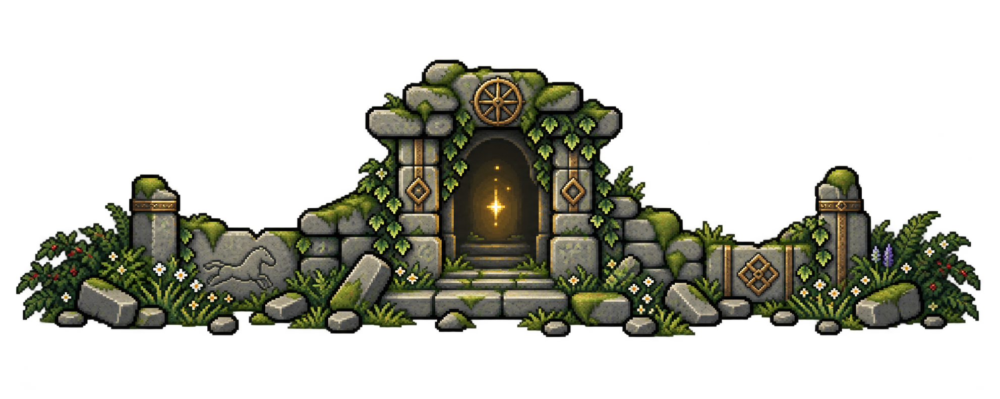
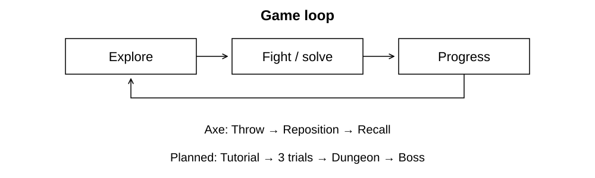

# 
ROAD OF THE OLD KING

# 
[PLAY HERE](https://ronno7.github.io/RoadOfTheOldKing/)

A top-down 2D action RPG built in Unity 6.3. Combat centers on a throwable hatchet: strike at close range, reposition after throwing, and Recall the weapon through enemies and puzzle targets.

<a href="Docs/SystemsOverview.md">Systems overview</a> · <a href="Docs/PlayerAnimation.md">Player animation</a> · <a href="Docs/World.md">World and tilemaps</a> · <a href="CHANGELOG.md">Changelog</a>

  

The browser release is an earlier mechanics prototype. The documentation and previews also cover the newer Tutorial world and player animation; Tutorial's progression sequence is still in development.

