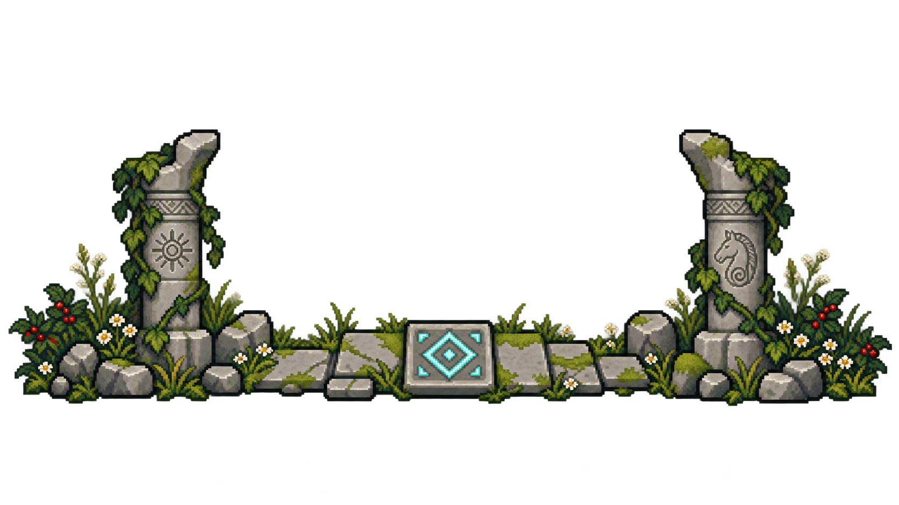

# 
THE LOST SHRINE

# 
[PLAY HERE](https://ronno7.github.io/TheLostShrine/)

## 
[Changelog](CHANGELOG.md)

<a href="Docs/VerticalSlice.md">Development plan</a> · <a href="Docs/SystemsOverview.md">Systems overview</a> · <a href="Docs/Art/README.md">Art guide</a>

  

## Workspace

Open `TheLostShrine/` in Unity Hub. `Tutorial` is the production scene; `PrototypeLoop` remains the mechanics reference and currently enabled build scene. The published browser build is older than current Tutorial development.

| Folder | Contents |
| --- | --- |
| `TheLostShrine/` | Unity project: runtime assets, scenes, scripts and editor importers |
| [Docs](Docs/VerticalSlice.md) | Development plan, animation backlog, systems overview and current art previews |
| [ArtSource](ArtSource/README.md) | Accepted source drawings, masks and rebuild inputs |
| [Tools](Tools/README.md) | Art exporters, capture helpers and focused verification |
| `Build/`, `TemplateData/`, `index.html` | Existing published WebGL output; retain root paths for hosting |
| `tmp/` | Ignored disposable work, local Pillow cache and recoverable cleanup archive |

Current player animations are accepted for now. Continue Tutorial gameplay; future animation work follows the [ranked backlog](Docs/AnimationPlan.md).
