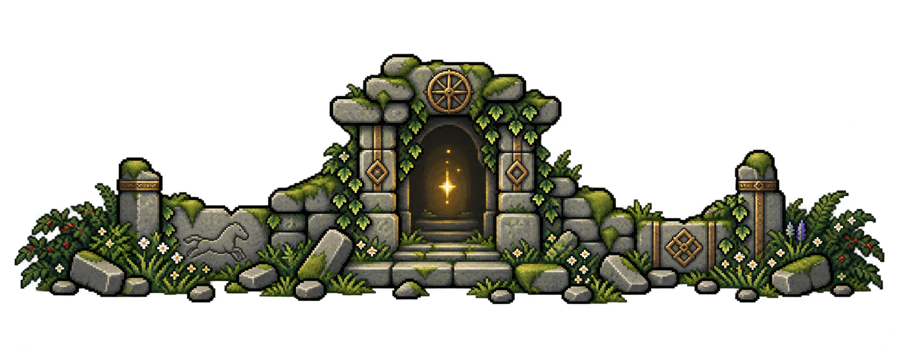
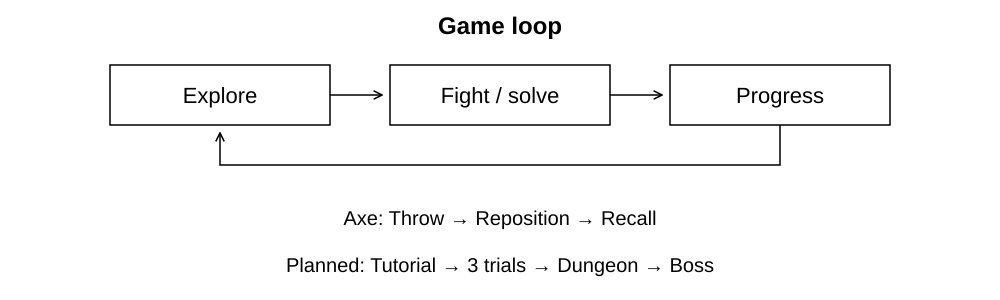
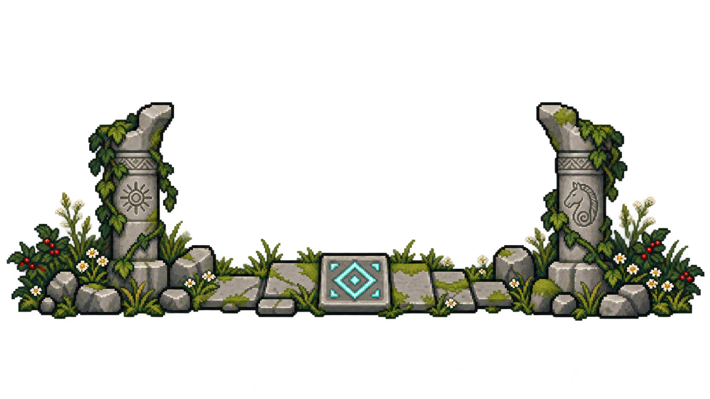

# 
ROAD OF THE OLD KING

# 
[PLAY HERE](https://ronno7.github.io/RoadOfTheOldKing/)

A top-down 2D action RPG built in Unity 6.3.

<a href="Docs/SystemsOverview.md">Systems overview</a> · <a href="Docs/PlayerAnimation.md">Player animation</a> · <a href="Docs/World.md">World and tilemaps</a> · <a href="CHANGELOG.md">Changelog</a>

  

The current source includes the Tutorial and Green Lowlands opening slice, with exploration, combat, a Recall puzzle and the first weapon upgrade. Later regions remain in development.

